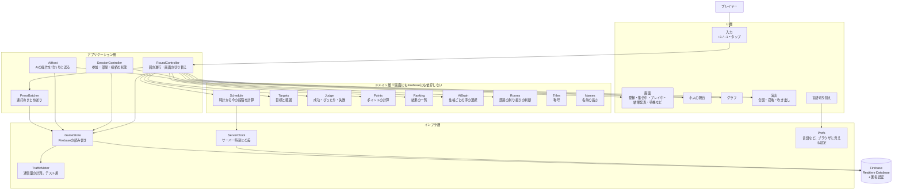
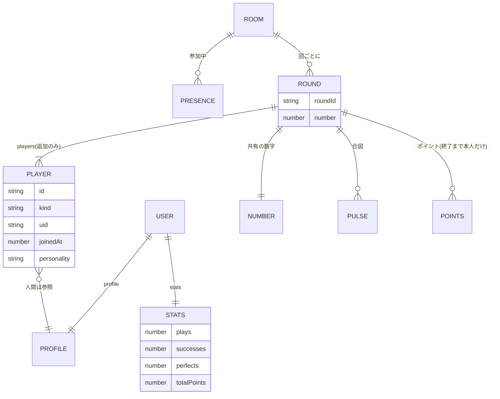
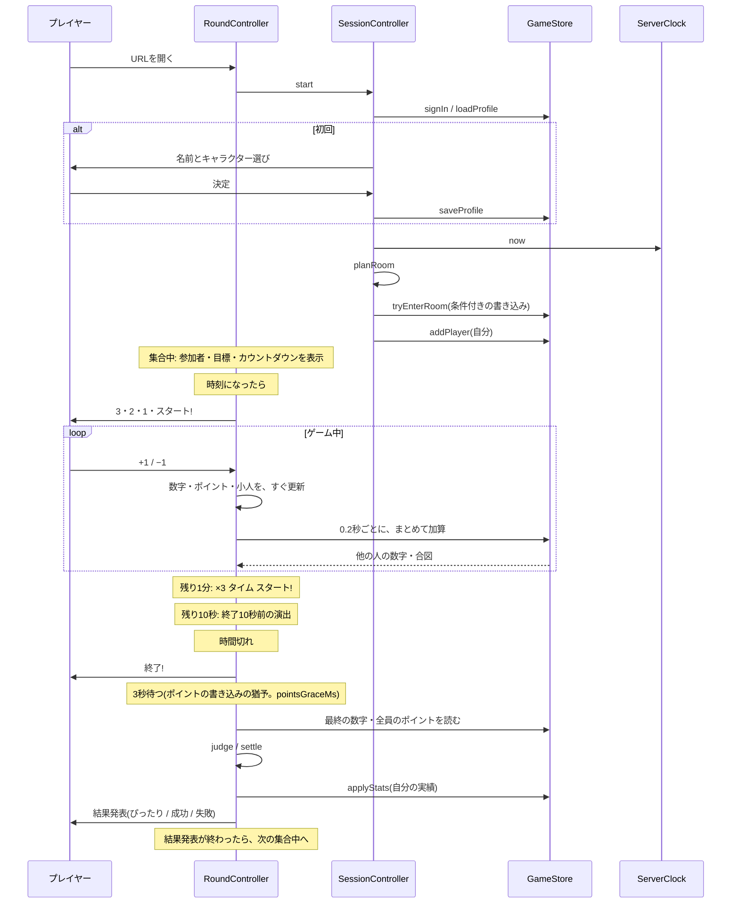
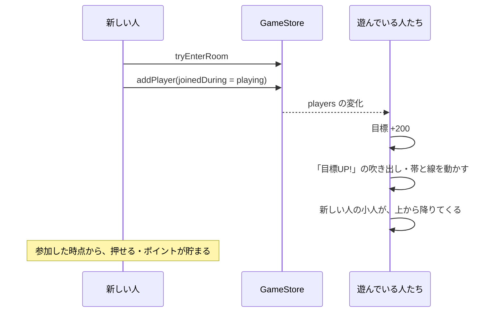
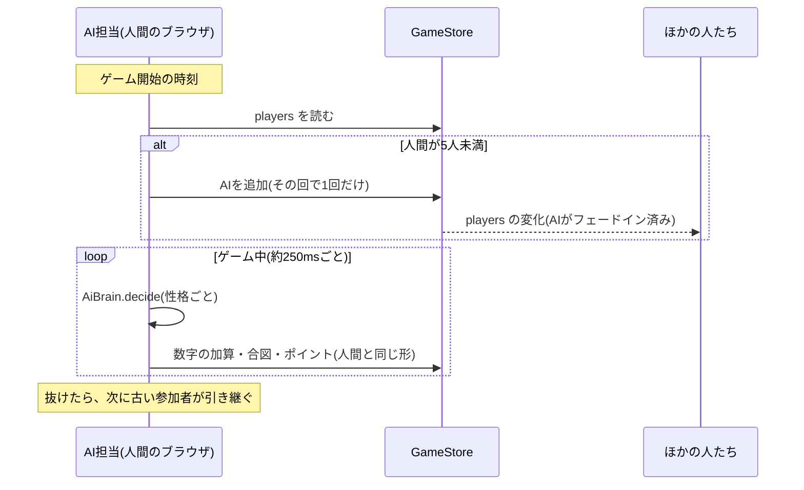
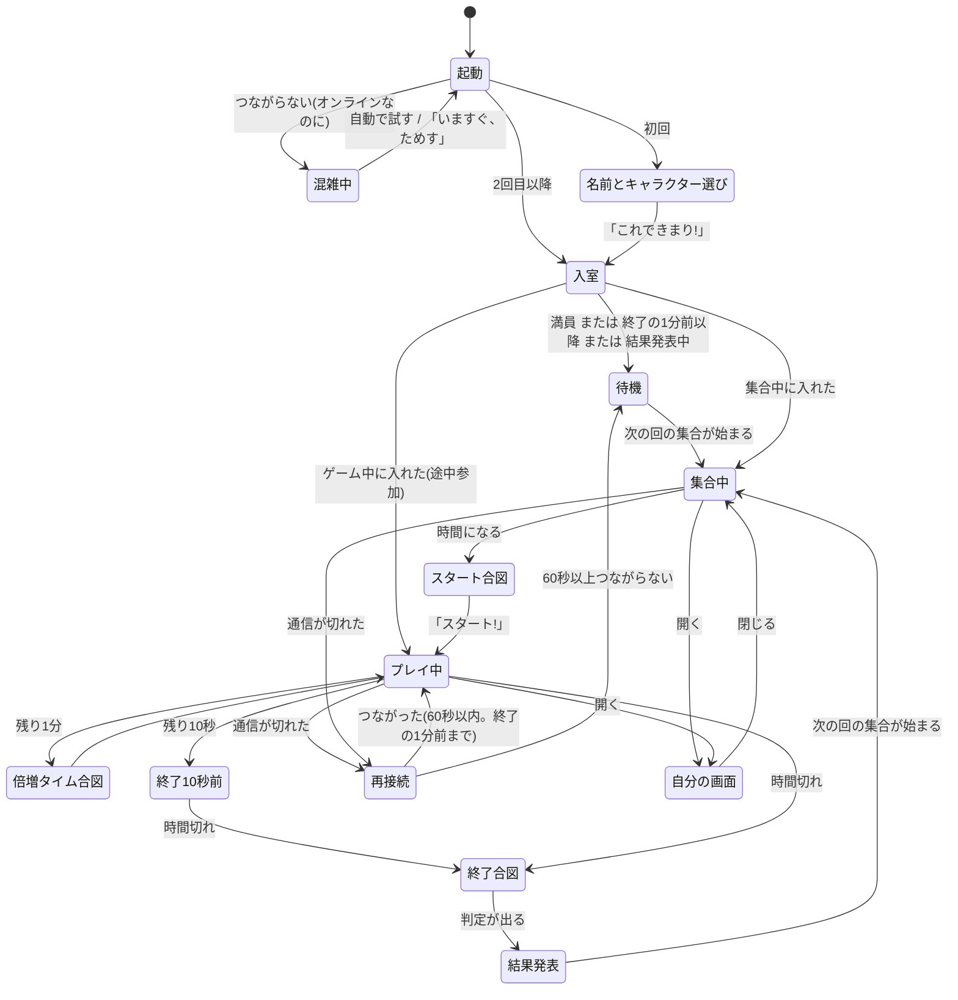

# 機能設計書 (Functional Design Document)

このドキュメントは、`docs/product-requirements.md`(PRD)で定義した「何を作るか」を「どう実現するか」に落とし込む。P0(MVP)を詳しく設計し、P1以降は拡張ポイントだけを示す。技術の最終的な選定と数値(ビルドの道具、データベースのセキュリティルールの書き方、通信量の見積もりなど)は `docs/architecture.md` で定める。画面の見た目と動きは、`docs/design/screens/README.md` と、その見本(`docs/design/screens/screens/*.html`)に従う。

## システム構成図

画面(UI層)、ゲームのルール(ドメイン層)、データベースとの通信(インフラ層)を分ける。ドメイン層は、画面にも、Firebaseにも依存しない純粋な処理にする。これにより、ルール(進行・目標・判定・ポイント・AIの動き)を、画面なしで自動テストでき、将来の大画面や専用コントローラー(P2)でも、そのまま使える。

サーバー側のプログラムは書かない。ブラウザが、Firebase Realtime Databaseに直接つなぐ。進行は、時計だけで決まる。



## 技術スタック

| 分類 | 技術 | 選定理由 |
| --- | --- | --- |
| 言語 | TypeScript | 状態や行動の型を明確にでき、ルールの実装ミスを減らせる |
| 画面 | DOM + SVG + CSSアニメーション(フレームワークなし) | 画面の要素が少なく、小人・グラフ・吹き出しはSVGで描ける。動きは、CSSのアニメーションで足り、「動きを減らす」設定にも、CSSで対応できる。フレームワークの選定は、`architecture.md` で最終判断する |
| ビルド | 静的ファイルを出力するビルドツール | itch.ioにzipでアップロードするため。選定は `architecture.md` で行う |
| テスト | Vitest + Firebase Emulator Suite | ドメイン層のユニットテストとシミュレーションにVitest。複数のクライアントが同時につなぐテストと、セキュリティルールのテストに、Emulator Suiteを使う |
| バックエンド | Firebase Realtime Database + 匿名認証 | サーバーのプログラムを書かずに、全員で1つの数字を共有できる。サーバー側で加算する命令(`increment`)で、同時に押しても取りこぼさない |
| 公開先 | itch.io | ブラウザゲームとして、zipでアップロードする |

## 用語の約束

用語の意味は、`docs/glossary.md` を正とする。この設計書でよく使う用語と、コード上の名前の対応だけを示す。

| 用語 | コード上の名前 |
| --- | --- |
| 回 | `roundIndex`・`roundId` |
| 段階 | `Phase`(`gathering`・`playing`・`result`) |
| 部屋 | `roomId` |
| プレイヤー | `Player` |
| 目標・範囲 | `target`・`lower`・`upper` |
| 倍増タイム | `bonusActive`・`bonusStartsAt` |
| 合図 | `Pulse` |

## データモデル定義

### 設定値(GameConfig)

仮の値や、遊びながら調整する値は、すべて設定ファイルにまとめる(コードに直接書かない)。初期値は、PRDの値と同じ。

一部の値は、データベースのセキュリティルール(`database.rules.json`)にも、同じ値を書く(ルールは、設定ファイルを読めないため)。どの値かの対応表は、`architecture.md` の「データベースの配置とセキュリティルール」を正とする。値を変えるときは、両方を直す。

```typescript
interface GameConfig {
  // 進行
  gatherMs: number;            // 集合中の長さ。30_000
  playMs: number;              // ゲーム中の長さ。300_000
  resultMs: number;            // 結果発表の長さ。30_000
  joinCutoffMs: number;        // 終了の何ミリ秒前から途中参加できないか。60_000
  pointsGraceMs: number;       // 終了のあと、ポイントを書き込める猶予。3_000(結果発表は、この時間のあとに出す)
  startCountdownMs: number;    // ゲーム開始の何ミリ秒前から「3・2・1」を出すか。3_000(1秒ずつ。開始の時刻に「スタート!」)
  finalCountdownMs: number;    // 終了の何ミリ秒前に「終了10秒前」の演出を出すか。10_000

  // 目標と範囲
  perPlayerTarget: number;     // 1人あたりの目標。200
  rangeRatio: number;          // 範囲の割合。0.10(目標の±10%)

  // ポイント
  bonusDurationMs: number;     // 倍増タイムの長さ。60_000
  bonusMultiplier: number;     // 倍増タイム中の倍率。3
  perfectMultiplier: number;   // ぴったり成功の倍率(仮)。2
  pointCap: number | null;     // 1回で貯められるポイントの上限。最初は null(なし)

  // 部屋とAI
  roomCapacity: number;        // 1部屋の最大人数。20
  aiFillTo: number;            // 人間が足りないとき、AIを足して、この人数にそろえる。5

  // 通信
  batchMs: number;             // 連打をまとめて送る間隔。200
  maxDeltaPerWrite: number;    // 1回の送信で、数字を変えられる量の上限(±)。50
  pulseIntervalMs: number;     // 合図を送る間隔(1人につき)。1_000
  pulsePowerSteps: [number, number, number]; // 合図の強さ(power)の段階。直近 pulseIntervalMs に押した回数が、これ以上なら 1・2・3。[1, 3, 6](仮)
  initialConnectTimeoutMs: number; // 起動時に、この時間つながらなければ、混雑中の画面を出す。5_000
  offlineScreenDelayMs: number;    // 通信が切れてから、再接続の画面を出すまで。3_000
  reconnectGraceMs: number;    // 通信が切れてから、続きから参加できる時間。60_000
  retryMs: number;             // 混雑中・通信切れで、自動で試す間隔。10_000

  // 表示
  pastWindowMs: number;        // グラフの過去の長さ。120_000(右から1/3が「いま」になるように、未来の2倍)
  futureWindowMs: number;      // グラフの未来の長さ。60_000(仮)
  resultTopN: number;          // 結果発表で出す上位の人数。7
  nameMaxUnits: number;        // 名前の長さの上限(全角を2、半角を1と数える)。12

  // データの掃除
  roundsToKeep: number;        // データベースに残す回の数(いまの回を含む)。2(仮。いまの回と、1つ前の回)

  // 称号
  titleRules: TitleRule[];     // 称号の条件(仮)。下の「称号」を参照
}
```

### 基本の型

```typescript
type Lang = 'ja' | 'en';
type Phase = 'gathering' | 'playing' | 'result';

/** サーバー時刻(ミリ秒)から計算した、いまの段階 */
interface RoundClock {
  roundIndex: number;       // 回の番号(0から)
  phase: Phase;
  phaseStartsAt: number;    // この段階が始まった時刻
  phaseEndsAt: number;      // この段階が終わる時刻
  playStartsAt: number;     // ゲーム開始の時刻
  playEndsAt: number;       // ゲーム終了の時刻
  bonusStartsAt: number;    // 倍増タイムの開始の時刻
  nextRoundStartsAt: number;// 次の回の集合が始まる時刻
}
```

### エンティティ: Profile(名前とキャラクター)

```typescript
interface Profile {
  name: string;               // ニックネーム。nameUnits(name) <= nameMaxUnits
  character: CharacterSpec;
}

interface CharacterSpec {
  hair: HairId;               // 5種類(仮): 'short' | 'spiky' | 'bob' | 'ponytail' | 'afro' など
  shirtColor: ShirtColorId;   // 8色
  accessory: AccessoryId;     // 'none' | 'glasses' | 'cap' | 'ribbon' | 'headphones'(仮)
}
```

**制約**: 名前は、HTMLとしては解釈せず、必ず文字として表示する。キャラクターの部品は、用意した種類の中からだけ選べる。

### エンティティ: Stats(実績)

```typescript
interface Stats {
  plays: number;           // 参加回数
  successes: number;       // 成功回数
  perfects: number;        // ぴったり成功の回数
  totalPoints: number;     // 累計ポイント
  lastCountedRound: string | null; // 最後に集計した回(同じ回を二重に数えないため)
}
```

AIの成績は、記録しない。

### エンティティ: Player(回の参加者)

```typescript
interface Player {
  id: string;                  // 回の中で一意。人間は uid、AIは 'ai-1' など
  kind: 'human' | 'ai';
  uid: string | null;          // 人間だけ
  name: string;                // 人間は Profile の名前。AIは言語ごとの名前の一覧から表示するので空でもよい
  character: CharacterSpec | null; // 人間だけ。AIはロボットの姿
  personality: AiPersonality | null; // AIだけ
  joinedAt: number;            // サーバー時刻。入った順(小人の並び順)に使う
  joinedDuring: 'gathering' | 'playing'; // 召喚の演出を出すかの判断に使う
}

type AiPersonality = 'greedy' | 'balancer' | 'perfectionist' | 'moody' | 'lastSpurt';
// 表示名(「がめついAI」など)は、言語ごとの文言の一覧に持つ
```

**制約**:

- 回の参加者の一覧(`players`)は、追加するだけで、人が抜けても削除しない。目標は、この数から計算するので、人が抜けても下がらない
- AIの数は、ゲーム開始時点で決め、途中で人間が入ってきても、変えない。ただし、ゲーム開始の時刻に人間が誰もいなかった回は、最初の人間が来た時点で、AIを足す(アルゴリズム設計の「7. AI担当と、AIの手」)
- 人間の `Player.id` には、今は `uid` をそのまま使う。席(`Player.id`)と匿名ID(`uid`)は、別の項目として持つので、将来、専用コントローラーなどで、1つの端末に複数の席を持たせるときは、`id` の作り方だけを変えればよい

### エンティティ: Round(回のデータ。データベースに置く)

```typescript
interface RoundData {
  number: number;                     // 共有の数字。0から。サーバー側で加算する
  players: Record<string, Player>;    // 回の参加者(追加するだけ)
  pulses: Record<string, Pulse>;      // プレイヤーごとの、最新の合図
  points: Record<string, number>;     // プレイヤーごとのポイント。ゲーム終了の3秒後(pointsGraceMs)まで、本人しか読めない
}

interface Pulse {
  t: number;       // サーバー時刻
  power: number;   // 直近の押し方の強さ(0〜3)。小人の跳ねる高さと速さに使う。計算は、下の pulsePowerFor
}
```

`power` は、直近 `pulseIntervalMs`(1秒)に押した回数(+1と−1の合計)から決める。

```typescript
function pulsePowerFor(pressCount: number, config: GameConfig): 0 | 1 | 2 | 3;
// pulsePowerSteps = [1, 3, 6](仮)のとき: 0回→0、1〜2回→1、3〜5回→2、6回以上→3
```

### データベースの配置

```
/users/{uid}/profile                        Profile
/users/{uid}/stats                          Stats
/roomCount                                  部屋の数
/rooms/{roomId}/memberCount                 いまの人間の人数(条件付きの書き込みで増減)
/rooms/{roomId}/presence/{uid}              参加中の印(接続が切れたら、自動で消える)
/rooms/{roomId}/aiHost                      AIの操作を送る担当の uid
/rooms/{roomId}/rounds/{roundId}/number
/rooms/{roomId}/rounds/{roundId}/players/{playerId}
/rooms/{roomId}/rounds/{roundId}/pulses/{playerId}
/rooms/{roomId}/rounds/{roundId}/points/{playerId}
```

- `roundId` は、回の番号(`roundIndex`)を10進の文字列にしたもの(例: `roundIndex = 4928211` なら `"4928211"`)。セキュリティルールの中でも、サーバー時刻(`now`)から同じ番号を計算して、照合する
- 回の開始・終了の時刻は、データベースに書かない。ルールも、画面と同じく、時計(`now`)から段階を計算する(アルゴリズム設計の「1. 時計から段階を計算する」)
- 読み書きの権限(セキュリティルール)の細かい書き方は、`architecture.md` で定める。ここでは、次の方針だけを決める
  - `profile`・`stats`: 誰でも読める。書けるのは本人だけ
  - `number`: いまの回の、ゲーム中(開始から終了まで)だけ、加算できる。終了時刻より後は、書けない。1回の変化は `maxDeltaPerWrite`(±50)まで
  - `players`: 追加できる。自分の分と、(AI担当なら)AIの分だけ
  - `pulses`: 自分の分(AI担当ならAIの分も)だけ書ける。誰でも読める
  - `points`: 自分の分(AI担当ならAIの分も)だけ書ける。終了の3秒後(`pointsGraceMs`)まで書け、その間は、本人しか読めない。3秒後からは、誰でも読める
- 古い回のデータは、AI担当が、集合中の始めに削除する。残すのは、`roundsToKeep`(2。いまの回と、1つ前の回)だけ

### エンティティ: RoundView(画面に出す、まとめた状態)

データベースの値と時計から、クライアントが組み立てる。画面の部品は、これだけを見る。

```typescript
interface RoundView {
  roomId: number;
  roundId: string;
  clock: RoundClock;           // 組み立てた時刻の回の時計(段階は clock.phase)
  number: number;              // サーバーの値 + まだ送っていない自分の分
  players: Player[];           // 入った順
  playerCount: number;         // 集合中は displayPlayerCount(人間の数)、それ以外は players の数
  target: number;              // targetFor(playerCount)
  lower: number;
  upper: number;
  inRange: boolean;
  myPoints: number;
  bonusActive: boolean;        // 倍増タイム中か
  pulses: Record<string, Pulse>; // 小人の跳ね方に使う
  samples: GraphSample[];      // グラフの標本(pastWindowMs より前は、最後の1つだけ残す)
  titles: Record<string, TitleId>; // 人間の参加者の称号(実績を読めた人だけ。集合中の名前の下に出す)
  result: ResultView | null;   // 終了の pointsGraceMs 後から
}

interface ResultView {
  outcome: Outcome;
  missBy: number | null;
  finalNumber: number;
  target: number;
  myPoints: number;            // 貯めたポイント(失敗のときも見せる)
  awarded: number;             // 報酬ポイント
  ranking: RankingView;
}
```

### 関連図



## コンポーネント設計

### Schedule(時計から段階を計算する)

**責務**: サーバー時刻から、いまが第何回の、どの段階かを計算する。誰かが開始時刻を書き込むのではなく、全員(と、データベースのセキュリティルール)が同じ計算をする。

```typescript
function roundClockAt(serverMs: number, config: GameConfig): RoundClock;
function roundId(roundIndex: number): string;   // データベースのキー。roundIndex を10進の文字列にする(例: 4928211 → "4928211")
function canJoinNow(clock: RoundClock, serverMs: number, config: GameConfig): JoinVerdict;

type JoinVerdict =
  | { ok: true }                                // 集合中、または、ゲーム中で終了の1分前より前
  | { ok: false; reason: 'lastMinute' };        // 終了の1分前以降、または、結果発表中
```

**依存関係**: なし(純粋な計算)

### ServerClock(サーバー時刻)

**責務**: 端末の時計のずれを、Firebaseが持つサーバー時刻との差(`.info/serverTimeOffset`)で補正した、「いまのサーバー時刻」を返す。

```typescript
interface ServerClock {
  now(): number;                       // 補正したサーバー時刻(ミリ秒)
  onOffsetChange(listener: () => void): () => void;
}
```

### Targets(目標と範囲)

```typescript
function targetFor(playerCount: number, config: GameConfig): number;   // playerCount × perPlayerTarget
function rangeFor(target: number, config: GameConfig): { lower: number; upper: number };
function isInRange(value: number, target: number, config: GameConfig): boolean;
function displayPlayerCount(humansInLobby: number, config: GameConfig): number; // 集合中に出す人数 = max(人間, aiFillTo)
```

### Judge(結果の判定)

```typescript
type Outcome = 'perfect' | 'success' | 'fail';
function judge(finalNumber: number, target: number, config: GameConfig): { outcome: Outcome; missBy: number | null };
// missBy: 失敗のとき、範囲に届かなかった量(「あと120足りなかった」。多すぎたときも同じ表示で、量だけを出す)
```

### Points(ポイントの計算)

```typescript
/** +1を押した瞬間の、ポイント。−1は0 */
function pointsForPress(input: {
  kind: '+1' | '-1';
  numberAtPress: number;
  target: number;
  nowMs: number;
  clock: RoundClock;
  currentPoints: number;   // この回で、いままでに貯めたポイント(pointCap を超えない量にするため)
}, config: GameConfig): number;
// ゲーム中(playStartsAt ≤ nowMs < playEndsAt)でなければ0

/** 結果が出たときの、報酬と累計の変化 */
function settle(outcome: Outcome, points: number, config: GameConfig): { awarded: number; statsDelta: StatsDelta };

interface StatsDelta { plays: 1; successes: 0 | 1; perfects: 0 | 1; totalPoints: number }
```

### Ranking(結果発表の一覧)

```typescript
interface RankRow { rank: number; player: Player; points: number; isMe: boolean }
interface RankingView {
  top: RankRow[];            // 上位 resultTopN 人
  me: RankRow | null;        // 自分が圏外のときだけ入る(「・・・」で区切って下に出す)
}
function buildRanking(players: Player[], points: Record<string, unknown>, myId: string | null, config: GameConfig): RankingView;
// points は他の人が書いた値なので、0以上の整数でなければ0として扱う
```

同点の人は、同じ順位にする(1, 1, 3)。同点の並びは、入った順(`joinedAt`)、次に `id` の順(どの端末でも同じ並びにする)。同点が7位をまたいでも、行数は7で切る。AIも一覧に入れる。

### Titles(称号)

```typescript
type TitleId = 'rookie' | 'regular' | 'hoarder' | 'perfectKing';
interface TitleRule { id: TitleId; when: (s: Stats) => boolean }  // 上から順に調べ、最初に合ったものを採用
function titleOf(stats: Stats, config: GameConfig): TitleId;
```

条件は、設定ファイルにある(PRDの未決定事項。ここに書くのは、最初の実装で使う仮の条件)。初期値(仮)は、上から順に、`perfects >= 5` なら 'perfectKing'(ぴったり王)、`totalPoints >= 2000` なら 'hoarder'(欲張り)、`plays >= 20` なら 'regular'(常連)、それ以外は 'rookie'(新人)。表示名は、言語ごとの一覧から引く。

### Names(名前の長さ)

```typescript
function nameUnits(name: string): number;           // 全角を2、半角を1と数えた合計
function validateName(name: string, config: GameConfig): { ok: true; name: string } | { ok: false; reason: 'empty' | 'tooLong' | 'invalidChar' };
// ok のときの name は、前後の空白を取った名前。保存するのは、こちら
```

全角(日本語、全角英数、全角記号)は2、半角(ASCII の英数字・記号・空白と、半角カナ)は1。それ以外の文字(絵文字など)も全角として数える。合計が `nameMaxUnits`(12)以下なら良い。前後の空白は取る。制御文字と、見えない書式の文字(ゼロ幅の文字、文字の向きの上書きなど)は使えない。

### Rooms(部屋の割り振りの判断)

```typescript
type RoomPlan =
  | { kind: 'enter'; roomId: number }          // この部屋に入る
  | { kind: 'create' }                         // 新しい部屋を作って入る(集合中だけ)
  | { kind: 'wait'; reason: 'full' | 'lastMinute' };

/** 部屋ごとの人数のスナップショットから、入る先を決める。実際の入室は、Store の条件付きの書き込みで確定する */
function planRoom(counts: number[], phase: Phase, joinVerdict: JoinVerdict, config: GameConfig): RoomPlan;
// counts[i] は、部屋 i + 1 の人間の人数(部屋の番号は1から)。条件付きの書き込みに負けたら、その部屋を満員として、もう一度呼ぶ
```

### AiBrain(AIの手の選択)

```typescript
interface AiView {
  number: number;          // AIが「見ている」数字(反応の遅れを表すため、少し前の値)
  target: number;
  lower: number;
  upper: number;
  remainingMs: number;     // ゲーム終了までの残り
  bonusActive: boolean;
  elapsedRatio: number;    // ゲームの経過の割合(0〜1)
}
interface Random { next(): number }   // テストでは、固定の値を返すものに差し替える

/** 一定の間隔(tick)ごとに呼ぶ。押すなら +1 か −1、何もしないなら null */
function decide(personality: AiPersonality, view: AiView, dtMs: number, random: Random, params: AiParams): '+1' | '-1' | null;
```

```typescript
/** 見せる数字・目標・時刻から、AiView を求める(範囲の端は rangeFor で求める) */
function aiViewAt(input: { number: number; target: number; nowMs: number; clock: RoundClock }, config: GameConfig): AiView;
/** 反応の遅れ(reactionDelayMinMs〜MaxMs)を選ぶ。AIには、この時間だけ前の数字を見せる */
function reactionDelayMs(random: Random, params: AiParams): number;
/** AIごとの勢い(1 ± tempoSpread)。押す頻度の倍率 */
function tempoFor(random: Random, params: AiParams): number;
/** 押す頻度(1秒あたりの回数)だけを tempo 倍した設定値 */
function withTempo(params: AiParams, tempo: number): AiParams;
/** AIを足すときの性格。5種類から重ならないように選び、足りなければ一巡してから重ねる */
function pickPersonalities(count: number, random: Random): AiPersonality[];
/** 種を固定できる疑似乱数(mulberry32) */
function createRandom(seed: number): Random;
```

押す頻度や反応の遅れは、`AiParams`(`domain/ai/aiParams.ts` の `DEFAULT_AI_PARAMS`。頻度は1秒あたりの回数で持ち、tick ごとの確率 `min(1, 回数 × dtMs / 1000)` に直す)にまとめる。範囲の中かどうかは、`Targets` の判断を使う(人間と同じ判断を、重複して書かない)。`AiView` は範囲の端を持っているので、`isInRange` と同じ判断を、範囲を受け取る `isWithinRange(value, range)` で行う(`isInRange` も、これを使う)。AIのポイントは、`decide` ではなく、`AiHost` が `pointsForPress` で計算する。

`decide` は状態を持たない。そのため、気まぐれの「毎秒、選ぶ」は、tick ごとの乱数で近似する(`burstChance` の確率で連打の頻度、それ以外はふだんの頻度。向きは半々)。

### GameStore(Firebaseの読み書き)

**責務**: Firebaseとのやりとりを、ここだけに閉じ込める。ドメイン層やUI層は、Firebaseの型を知らない。Emulator Suiteにも、本番にも、同じ形でつなげる。

```typescript
interface GameStore {
  // 認証・プロフィール
  signIn(): Promise<{ uid: string }>;
  loadProfile(uid: string): Promise<Profile | null>;
  saveProfile(uid: string, profile: Profile): Promise<void>;
  loadStats(uid: string): Promise<Stats>;
  applyStats(uid: string, roundId: string, delta: StatsDelta): Promise<void>; // 同じ回は二重に数えない(lastCountedRound)

  // 接続
  onConnection(listener: (state: 'online' | 'offline') => void): () => void;

  // 部屋
  readRoomCounts(): Promise<number[]>;
  tryEnterRoom(roomId: number, uid: string, capacity: number): Promise<boolean>;  // 条件付きの書き込み
  createRoom(uid: string): Promise<number>;                                     // 集合中だけ呼ぶ
  leaveRoom(roomId: number, uid: string): Promise<void>;                         // 接続が切れたときの自動の削除も、ここで登録する
  onPresence(roomId: number, listener: (members: Record<string, { joinedAt: number }>) => void): () => void; // 参加中の印(AI担当の引き継ぎの順に使う)
  claimAiHost(roomId: number, roundId: string, uid: string): Promise<boolean>;
  onAiHost(roomId: number, listener: (uid: string | null) => void): () => void;

  // 回
  addPlayer(roomId: number, roundId: string, player: Player): Promise<void>;
  onPlayers(roomId: number, roundId: string, listener: (players: Player[]) => void): () => void;
  addToNumber(roomId: number, roundId: string, delta: number): Promise<void>;   // サーバー側で加算する命令。|delta| ≤ maxDeltaPerWrite
  onNumber(roomId: number, roundId: string, listener: (n: number) => void): () => void;
  sendPulse(roomId: number, roundId: string, playerId: string, power: number): Promise<void>;
  onPulses(roomId: number, roundId: string, listener: (p: Record<string, Pulse>) => void): () => void;
  writePoints(roomId: number, roundId: string, playerId: string, points: number): Promise<void>;
  readPoints(roomId: number, roundId: string): Promise<Record<string, number>>; // ゲーム終了の3秒後から読める
  deleteRound(roomId: number, roundId: string): Promise<void>;                  // 古い回の削除(AI担当だけ)
}
```

- ルールに拒否された書き込みは、例外にしない(「エラーハンドリング」の表: 無視して、画面はデータベースの値に合わせる)。条件付きの書き込み(`tryEnterRoom`・`claimAiHost`)は `false` を返す
- `readPoints` は、読める分だけを返す(自分の分はいつでも、他の人の分は終了の3秒後から)
- サインインの前の呼び出しは `StoreError('notSignedIn')`、接続が切れている間の書き込みは `StoreError('offline')`(`infra/store/StoreError.ts`)
- 購読は、登録したときに今の値を1回知らせ、変わるたびに知らせる
- メモリ上の実装(`InMemoryGameStore`)は、全員で共有する `InMemoryServer`(データとルールの判断)と、利用者ごとの窓口に分ける。ルールの判断は `database.rules.json` と同じにする

**依存関係**: Firebase SDK(`architecture.md` で定める)

### PressBatcher(連打のまとめ送り)

**責務**:

- 押された+1・−1を数えて、`batchMs`(0.2秒)ごとに、まとめて1回送る(「+1を5回」ではなく「+5を1回」)
- 1回に送る量は、`maxDeltaPerWrite`(±50)までにする。超えた分は、次の送信に回す(セキュリティルールで、1回の変化が±50を超える書き込みは、まるごと拒否されるため)
- 自分の画面には、送る前でも、すぐ反映する(押した分は、サーバーから届く値に足して見せる)
- 合図(`sendPulse`)は、`pulseIntervalMs`(1秒)に1回までにまとめる。押したとき、前の合図から1秒たっていればすぐ送り、そうでなければ、前の合図の1秒後に1回だけ送る。`power` は、直近1秒に押した回数から `pulsePowerFor` で計算する(0なら送らない)
- 貯めたポイントの合計が増えていれば、数字と一緒に `writePoints` で書く。ポイントの計算(`pointsForPress`)は、押した瞬間の画面の数字が要るので、呼ぶ側(`RoundController`・`AiHost`)が行い、合計を `press` に渡す
- ゲーム終了の時刻になったら、数字と合図を送るのをやめる(まだ送っていない分は失われる)。ポイントは、終了の3秒後まで書けるので、最後に1回書く
- 接続が切れて送れなかった分(`StoreError`)は、次の送信でやり直す。それ以外のエラーは `onError` で上に伝える
- タイマーは `Scheduler`(`infra/store/Scheduler.ts`)を通す。テストでは `FakeClock` が時計とタイマーを一緒に進める

```typescript
interface PressSlot { roomId: number; roundId: string; playerId: string; playEndsAt: number }

class PressBatcher {
  constructor(deps: { store: GameStore; clock: ServerClock; scheduler: Scheduler; config: GameConfig; onError: (error: unknown) => void }, slot: PressSlot);
  press(kind: '+1' | '-1', totalPoints: number): void;  // 押された。totalPoints は、押したあとの、この回で貯めたポイントの合計
  pendingDelta(): number;             // まだ送っていない分(画面の数字に足す)
  stop(): void;                       // 止める。この後は、何も送らない
}
```

### AiHost(AIの操作を代わりに送る)

**責務**:

- 部屋で「AI担当」になっている人間のブラウザが、その部屋のAI全員の操作を、人間と同じ形(数字の加算、合図、ポイント)で送る
- ゲーム開始時に、人間が `aiFillTo` 人に足りなければ、足りない数のAIを、性格を変えて、`players` に追加する(1回だけ。条件付きの書き込みで、二重に追加しない)
- ゲーム中にAI担当になったとき、その回にまだAIがいなくて、`players` の人間が `aiFillTo` 人に足りなければ、その時点でAIを足す(ゲーム開始の時刻に人間が誰もいなかった回に、途中から人間が来た場合)
- AI担当が抜けたら、次に古い参加者が引き継ぐ(`claimAiHost`)。人間が全員抜けたら、AIを送る人がいなくなるので、AIも止まり、その回は、そのまま過ぎる
- AIのポイントも、人間と同じ計算(`pointsForPress`)で貯め、`points` に書く
- AIの数字の加算も、`PressBatcher` と同じく、1回に `maxDeltaPerWrite` までにする
- 集合中の始めに、`roundsToKeep` より古い回のデータを削除する(`deleteRound`)

**インターフェース**:

```typescript
class AiHost {
  constructor(
    deps: { store: GameStore; clock: ServerClock; scheduler: Scheduler; config: GameConfig; aiParams: AiParams; random: Random; onError: (error: unknown) => void },
    seat: { roomId: number; uid: string }  // どの部屋の、誰のブラウザか
  );
  start(): void;      // 部屋の aiHost を購読し、自分が担当のあいだだけ動く(担当を取りにいくのは SessionController)
  stop(): void;       // 部屋を出た。すべて止める
  isActive(): boolean;
}
```

- 回の始め(と、担当になったとき)に、いまの回の `players`・`number` を購読し、古い回を1つ消す(`roundIndex − roundsToKeep` の回)
- AIの追加は、ゲーム中で `players` が届いてから、その回で1回だけ試す。AIの id は `ai-1` から順に決めるので、別の担当が同時に足しても、ルール(追加だけ)で二重にならない
- 足す数を決めるとき、担当の自分は、まだ `players` にいなくても、人間として数える(人間が誰もいなかった回に来た人が、自分の追加より先に担当になる場合)
- `joinedDuring` は、ゲーム開始の前から担当だったなら `'gathering'`、ゲーム中に担当になったなら `'playing'`
- AIごとに、反応の遅れ(`reactionDelayMs`)と勢い(`tempoFor`)を決め、届いた数字の記録から、その時間だけ前の値を見せる。`decide` は、id の順に呼ぶ(乱数の使い方を決まった順にし、結果を再現できるようにする)
- 引き継いだときは、AIのポイントを0から数え直す。前の担当が書いた値は、終了の3秒後まで読めない(ルール)ため。ポイントは減らせないので、前の値より小さい間の書き込みは、ルールで拒否され、前の値が残る(AIのポイントが少し少なくなるだけで、人間には影響しない)
- `addPlayer`・`deleteRound` の `StoreError`(切断など)は、無視する(次の回でやり直す)。それ以外のエラーは `onError` に伝える

### SessionController(参加・部屋・接続)

**責務**:

- 初回の登録(名前とキャラクター)、サインイン、プロフィールと実績の読み込み
- 部屋への入室(`planRoom` で決めて、`tryEnterRoom` で確定)と、退出
- 接続の状態(オンライン・オフライン・混雑中)の管理と、再接続
- 部屋の `presence` と `aiHost` を購読し、AI担当がいなくなったら、自分がそのとき最も古い参加者なら、`claimAiHost` を試す
- 回が変わったら、同じ部屋で、そのまま次の回の参加者になる

**インターフェース**:

```typescript
type SessionState =
  | { kind: 'connecting' }                                   // 起動中
  | { kind: 'busy'; attempts: number }                        // 混雑中(端末はオンラインなのに、つながらない)
  | { kind: 'offline'; attempts: number }                     // 起動時に、端末がオフライン
  | { kind: 'needsProfile' }                                  // 初回の登録を待つ
  | { kind: 'entering' }                                      // 部屋を決めている
  | { kind: 'waiting'; reason: 'full' | 'lastMinute' | 'afterOffline'; until: number } // 待機(until に、もう一度試す)
  | { kind: 'inRoom'; roomId: number; roundId: string; joinedDuring: 'gathering' | 'playing' }
  | { kind: 'reconnecting'; roomId: number; attempts: number }; // 部屋にいるあいだに切れた

class SessionController {
  constructor(deps: {
    store: GameStore; clock: ServerClock; scheduler: Scheduler; config: GameConfig;
    deviceOnline: () => boolean;                                        // navigator.onLine
    createAiHost: (seat: { roomId: number; uid: string }) => { start(): void; stop(): void };
    onError: (error: unknown) => void;
  });
  start(): void;
  stop(): Promise<void>;                                                 // 部屋を出て、すべて止める
  register(name: string, character: CharacterSpec): Promise<NameVerdict>; // 使えない名前なら保存しない
  retryNow(): void;                                                      // 「いますぐ、ためす」
  onState(listener: (state: SessionState) => void): () => void;          // 登録したときにも1回知らせる
  state(): SessionState;
  uid(): string | null;
  profile(): Profile | null;
  stats(): Stats | null;                                                 // 読み込みに失敗したら null
}
```

- 状態と画面の対応: `busy` は混雑中、`offline`・`reconnecting` は通信が切れたとき、`needsProfile` は名前とキャラクター選び、`waiting` は待機(`full` は満員、`lastMinute`・`afterOffline` は終了間際)。`inRoom` の中の段階(集合中・プレイ中・結果発表)は、`RoundController` が時計から決める
- 入室: `readRoomCounts` → `planRoom`。`tryEnterRoom` に負けたら、その部屋を満員として決め直す。待機は、次の回の集合の始めに、もう一度試す。切断などで決められなければ、`retryMs` 後にやり直す
- 部屋にいるあいだ: 次の回の集合の始めに、次の回の参加者になる(同じ回に2回は足さない)。`AiHost` を動かす。担当がいなければ、`presence` の `joinedAt` が最も古い人(同じなら uid の順)が `claimAiHost` を試す
- 部屋にいるあいだに切れたら、部屋の購読と `AiHost` を止める。つながったとき、続きから参加できなければ、集合中ならすぐ、それ以外は次の回の集合で、入室し直す(`waiting: afterOffline`)
- サーバー時刻の差が変わったとき(時刻が飛んだとき)の、タイマーの組み直しは、まだしない(`RoundController` と一緒に決める)

### TrafficMeter(通信量の計測。テスト用)

**責務**: PRDの機能9。1回のプレイで受け取った更新の回数とバイト数を数える。

- `GameStore` の Firebase 実装の中で、購読の関数(`onNumber`・`onPlayers`・`onPulses` など)に値が届くたびに、回数と、値をJSONにしたときのバイト数(`JSON.stringify` の長さ。UTF-8)を足す。送った分(`addToNumber` など)も、同じように数える
- ゲーム終了の3秒後(結果を読んだあと)に、その回の合計(受信の回数・バイト数、送信の回数・バイト数、部屋の人数)を、コンソールに出す。画面の右下にも、小さく出す
- ビルドの時の設定(`VITE_TRAFFIC_METER=1`)のときだけ、有効にする。itch.io に出すビルドでは、無効にする(画面にも出さない)
- 数えるのは、アプリが受け取った値の大きさで、実際の通信量(Firebase の管理画面のダウンロード量)とは、ずれる。テストプレイでは、両方を見比べる(`architecture.md` の「通信量の計測」)

```typescript
interface TrafficMeter {
  countIn(path: string, value: unknown): void;
  countOut(path: string, value: unknown): void;
  report(roundId: string, playerCount: number): TrafficReport;  // その回の合計を返し、数え直す
}
interface TrafficReport { roundId: string; playerCount: number; inCount: number; inBytes: number; outCount: number; outBytes: number }
```

### RoundController(回の進行と画面の切り替え)

**責務**:

- 時計を見て、画面を切り替える(集合中 → 合図 → プレイ中 → 終了 → 結果発表 → 次の集合中)
- 数字・参加者・合図の変化を受け取り、`RoundView` を組み立てて、画面に渡す
- 押された操作を、`PressBatcher` とポイントの計算に渡す
- 目標が上がったこと(参加者が増えたこと)を見つけて、演出を出す
- 結果が出たら、`judge` と `settle` を計算して、実績を保存し、結果発表の画面を出す

```typescript
type RoundEvent =
  | { kind: 'cue'; cue: 'start' | 'x3' | 'tenSeconds' | 'end' }   // 合図(start は開始の startCountdownMs 前)
  | { kind: 'summon'; player: Player; targetFrom: number; targetTo: number } // ゲーム中に人間が加わった
  | { kind: 'fadeIn'; player: Player }                              // AIが加わった
  | { kind: 'myPress'; press: '+1' | '-1'; gain: number };          // 自分が押した(跳ねる・吹き出し・ポイントを弾ませる)

class RoundController {
  constructor(
    deps: { store: GameStore; clock: ServerClock; scheduler: Scheduler; config: GameConfig; onError: (error: unknown) => void },
    session: { onState(listener: (state: SessionState) => void): () => void; uid(): string | null }
  );
  start(): void;
  stop(): void;
  press(kind: '+1' | '-1'): void;                                   // ボタンが押された
  onView(listener: (view: RoundView | null) => void): () => void;   // 部屋にいないときは null。登録したときにも1回
  onEvent(listener: (event: RoundEvent) => void): () => void;
}
```

- 画面を持たない。UI層は、`RoundView` と `RoundEvent` だけを見て描く。小人のタップ(実績カード)・自分の画面・言語の切り替えは、UI層を作るときに足す
- `SessionController` の `inRoom` の回が変わったら、前の回(購読・`PressBatcher`・タイマー)を止めて、新しい回を始める
- 押す操作は、ゲーム中(開始〜終了)で、つながっているときだけ受け付ける
- 参加者の変化: 最初に届いた一覧は演出なし。そのあと、AIは `fadeIn`、ゲーム中に入った人間は `summon`(加わる前と後の目標)
- 結果: 終了の `pointsGraceMs` 後に `readPoints` → `judge`・`settle`・`buildRanking`。自分が参加者の一覧にいれば `applyStats`。読み込み・保存の `StoreError` は、`retryMs` ごとに、次の回の始めまでやり直す。保存の失敗は、結果の表示に影響させない
- 時刻が飛んだとき(`onOffsetChange`)は、合図・結果のタイマーを組み直す。過ぎた合図は出さない。結果の時刻を過ぎていたら、すぐ結果を出す
- 途中から戻ったとき(新しく回を始めたとき)は、`readPoints` で自分のポイントを読み直す(0に戻さない)

### UI層(画面の描画)

**責務**:

- 18の画面(下の「UI設計」)の描画と、演出(CSSアニメーション)
- 入力(+1、−1、小人のタップ、ボタン)を、`RoundController` に伝える
- 文言は、すべて、言語ごとの一覧から引く(画面の部品に、文言を直接書かない)

アプリケーション層は、画面を呼ばない。`SessionController`(`onState`)と `RoundController`(`onView`・`onEvent`)が、状態と出来事を知らせ、UI層の `DomGameView` が、それを購読して画面を選んで描く(最初の設計の `GameView` インターフェース — アプリケーション層が画面を呼ぶ形 — は使わない)。

```typescript
class DomGameView {
  constructor(deps: {
    root: HTMLElement;                  // #app
    session: SessionController;
    round: RoundController;
    config: GameConfig;
    now: () => number;                  // サーバー時刻(待機のカウントダウン)
  });
  start(): void;                        // 状態の購読と、言語の切り替えボタン
  showError(): void;                    // 想定外のエラー: 画面全体を止め、再読み込みのボタンを出す
}
```

| セッションの状態 | 画面 |
| --- | --- |
| `connecting`・`entering` | つないでいる途中(見出しだけ) |
| `busy` | 混雑中(17) |
| `offline`・`reconnecting` | 通信が切れたとき(16) |
| `needsProfile` | 名前とキャラクター選び(01) |
| `waiting` | 待機(`full` は 14、`lastMinute`・`afterOffline` は 15 の形) |
| `inRoom` | 集合中・プレイ中・結果発表(`RoundView` の段階で選ぶ) |

- 画面は、固定のテンプレートから作り、文言・名前・数字は、あとから文字として入れる(他の人の名前を `innerHTML` に渡さない)
- 言語が変わったら、いまの画面を作り直す(名前とキャラクター選びの入力は残す)
- 髪と肌の色は、選べない(見本 01 にない)。参加者の id から決まった色にする(どの端末でも同じ)
- 部屋の中は `RoomScreen` が、`RoundView` の段階で、集合中(02・03)・プレイ中(05)・結果発表を出し分け、合図(04・07・08・09)を上に重ねる。view は届くたびに描かず、1コマに1回にまとめる(数字が1秒に何十回も変わるため)。時間で動くもの(カウントダウン・グラフ)は、250ms ごとにも描く
- 集合中のAIの席: AIはゲーム開始の時刻に加わるので、集合中は、まだ性格が決まっていない。人間が `aiFillTo` 人に足りない分だけ、灰色のランプのロボットと「AI」の札の席を出す(見本 03 の名前「がめついAI」などは、ゲーム開始のあとの舞台で分かる)
- AIのロボットの胸のランプ: がめつい=赤・気まぐれ=青・調整役=緑(見本 03)、ぴったり主義=黄・ラストスパート=紫(仮)
- プレイ中のグラフは、画面の高さに合わせて伸び縮みする(見本は高さ306pxで固定。背の低いスマホで、ボタンが画面の外に出ないようにする)
- 「動きを減らす」設定のときは、跳ねる代わりに小人を光らせ、「3・2・1」は出さずに「スタート!」だけを出す(見本のCSSのとおり)

### i18n(言語)

`src/app/i18n/i18n.ts` が、言語を持つ。

```typescript
function getLang(): Lang;
function setLang(lang: Lang): void;                       // 変わったときだけ、登録した関数すべてに知らせる。ブラウザに覚える
function onLangChange(listener: (lang: Lang) => void): () => void;
function t(key: MessageKey, params?: Record<string, string | number>): string;  // 今の言語の文言
```

- すべての文言は、言語ごとの一覧(`ja`・`en`)に置く。コードや画面の部品に、直接書かない
- 称号、AIの名前、演出の文字、注意書き、メッセージも、一覧に入れる。他の人が付けた名前は、翻訳しない
- 英語の文言は、日本語の文言をもとに、短く、やさしい言葉で作る
- 初めて開いたときの言語は、ブラウザの言語設定に合わせる(日本語なら日本語、それ以外は英語。仮。`detectLang`)。選んだ言語は、ブラウザに覚える(`infra/prefs.ts`)。覚えられない場合(itch.ioのiframeなど)は、開いている間だけ保つ。i18n は infra に依存せず、`main.ts` が、覚えた言語で `setLang` し、`onLangChange` で覚える

## アルゴリズム設計

### 1. 時計から段階を計算する

**目的**: 全員が、同じ時計から、同じ答えを得る。誰かが開始時刻を書き込む必要がない。

```
cycle = gatherMs + playMs + resultMs
roundIndex = floor(serverMs / cycle)
offset = serverMs mod cycle
phase =
  offset < gatherMs                → 'gathering'
  offset < gatherMs + playMs       → 'playing'
  それ以外                          → 'result'
playStartsAt   = roundIndex × cycle + gatherMs
playEndsAt     = playStartsAt + playMs
bonusStartsAt  = playEndsAt − bonusDurationMs
nextRoundStartsAt = (roundIndex + 1) × cycle
```

- `serverMs` は、`ServerClock.now()`(端末の時計を、サーバー時刻との差で補正した値)
- 画面の切り替え(3・2・1、×3タイム、10秒前、終了)は、この時刻に合わせて、タイマーで出す
- 時刻の基準(0)は、Unix 時刻の0(1970-01-01 00:00 UTC)で、全員同じ。データベースのセキュリティルールも、`now % cycle` で、同じ計算をする。1周は、既定で360秒

### 2. 目標と範囲

```
playerCount = players の数(人間 + AI。追加するだけで、減らない)
target = playerCount × perPlayerTarget
lower  = ceil(target × (1 − rangeRatio))
upper  = floor(target × (1 + rangeRatio))
inRange(v) = lower ≤ v ≤ upper
```

- **集合中**: 画面に出す人数は `displayPlayerCount = max(人間の数, aiFillTo)`(人間が5人未満のときは、AIが加わる前提で、5人として見せる)。例: 人間12人なら 12×200=2,400(範囲 2,160〜2,640)、人間2人なら 5×200=1,000(範囲 900〜1,100)
- **ゲーム開始**: AI担当が、人間が `aiFillTo` 人に足りなければ、AIを足す。このとき、`players` の数が確定する(ゲーム開始の時刻に人間が誰もいなかった回は、最初の人間が来た時点で、AIを足す)
- **途中参加**: 人間が `players` に追加されると、`playerCount` が1つ増え、目標が200増える。範囲も、目標の±10%のまま変わる
- **人が抜けたとき**: `players` は減らさないので、目標は下がらない
- 目標が変わったら、画面の「いまの目標」・グラフの帯と点線・縦軸の数字が、少しアニメーションしながら更新される

### 3. ポイントの計算

```
+1を押したとき:
  numberAtPress = 押した瞬間に画面に出ていた数字(サーバーの値 + まだ送っていない自分の分)
  if now ≥ bonusStartsAt かつ inRange(numberAtPress):  gain = bonusMultiplier(3)
  else:                                                gain = 1
  points += gain   (pointCap があり、超えるなら、cap まで)
  ゲーム中でなければ(終了の時刻を過ぎていたら) gain = 0

−1を押したとき:
  gain = 0
```

- 「範囲の中で押した」かどうかは、押した瞬間の数字で判定する(画面に出ている数字)
- 画面の「あなたのポイント」は、押すたびに、`gain` ずつ増えて、数字が弾む
- ポイントは、`batchMs` ごとの送信と合わせて、`points/{playerId}` に書く(ブラウザから)。ゲーム終了の3秒後(`pointsGraceMs`)まで、本人しか読めない
- 画面の吹き出し「+1」は、倍増タイム中も「+1」のまま。ポイントが3倍になることは、「あなたのポイント」の数字で見せる(「+3」にすると、目標の数字が3増えたように見えるため)。−1のときは「−1」

### 4. 結果の判定と報酬

ゲーム終了時刻(`playEndsAt`)になったら、「終了!」の演出を出す。その3秒後(`pointsGraceMs`。最後のポイントの書き込みを待つ猶予。`architecture.md` を参照)に、全員の画面が、データベースの最終値と、全員のポイントを読んで、結果を出す。終了時刻より後は、数字の加算が受け付けられないので、最終値は、全員同じになる。

```
final = 終了時刻の number
target = targetFor(players の数)      // 終了時点の人数
outcome =
  final == target                         → 'perfect'
  lower ≤ final ≤ upper                   → 'success'
  それ以外                                 → 'fail'
missBy = 'fail' のとき: final < lower なら lower − final、final > upper なら final − upper
```

報酬と実績(自分の分だけ、ブラウザが計算して保存する):

| 結果 | 報酬ポイント | 実績の変化 |
| --- | --- | --- |
| ぴったり | 貯めたポイント × perfectMultiplier(仮に2) | plays +1、successes +1、perfects +1、totalPoints に報酬を足す |
| 成功 | 貯めたポイント | plays +1、successes +1、totalPoints に報酬を足す |
| 失敗 | 0(貯めたポイントは、結果発表で見せるだけ) | plays +1 だけ |

- 同じ回を二重に数えないよう、`lastCountedRound` を使う
- 途中参加の人も、参加した回は、`plays` に数える
- AIの分は、実績に記録しない

### 5. 結果発表の一覧

- 終了の3秒後から、`points` が、全員読める。`buildRanking` で、ポイントの多い順に並べる
- 上位7人と、自分の行を出す。自分が圏外なら、7位の下に「・・・」を出して、自分の行を下に出す
- 失敗のときも、貯まっていたポイントを載せる。AIも載せる

### 6. 部屋の割り振り

```
join(uid):
  clock = roundClockAt(now)
  verdict = canJoinNow(clock, now)
  if verdict が NG(終了の1分前以降、または結果発表中):  → 待機画面(lastMinute)

  counts = 部屋ごとの人間の人数
  for roomId in 1..roomCount:
     if counts[roomId] < roomCapacity かつ tryEnterRoom(roomId) が成功: → その部屋に入る
        // tryEnterRoom は、memberCount の条件付きの書き込み。同時に何人かが入ろうとしても、20人を超えない
  全部の部屋が満員:
     if clock.phase == 'gathering': createRoom() して、その部屋に入る
     else:                         → 待機画面(full)
```

- 部屋は、先着で埋める。新しい部屋を作るのは、集合中のときだけ(ゲーム中に、人もAIもいない状態から、途中で始まるのを避ける)
- 一度入った部屋には、接続している間、とどまる。次の回も、同じ部屋の参加者になる
- 将来は、回の切れ目に、均等に分け直す案がある(今は入れない)

### 7. AI担当と、AIの手

#### AI担当

```
部屋の presence に、入った順(joinedAt)が最も古い人間が、AI担当になる。
claimAiHost は、条件付きの書き込みで、1人だけが成功する。
全員が presence と aiHost を購読する。AI担当が抜けたとき(presence が消えたとき)、
そのとき最も古い人が claimAiHost を試す(失敗したら、ほかの人が担当になったので、何もしない)。
```

#### ゲーム開始時のAIの追加

```
ゲーム開始の時刻に、AI担当が実行:
  humans = 人間の数
  if humans < aiFillTo:
     n = aiFillTo − humans
     性格を、5種類の中から、重ならないように選び(足りなければ、重なってもよい)、AIを n 人 players に追加する
     (追加は、その回で1回だけ。すでに追加されていれば、何もしない)

ゲーム中に AI担当になったとき(引き継ぎ、または、人間が誰もいなかった回に、最初に来た人):
  if その回の players に AI がいない かつ players の人間の数 < aiFillTo:
     上と同じように、AIを追加する(joinedDuring = 'playing')
     ・AIは、召喚せず、フェードインで現れる。「目標UP!」の演出も出さない(人間が来たときだけ出す)
  回の途中で人間が全員抜けたら、AIを送る人がいないので、AIも止まり、その回はそのまま過ぎる
```

#### AIの手(性格ごとの、初期値の方針。数値は、設定ファイルで調整する)

AIは、一定の間隔(例: 250ms)ごとに、`decide` を呼ぶ。AIが見る数字には、反応の遅れ(0.3〜0.8秒前の値)とばらつきを付ける。

| 性格 | 方針 |
| --- | --- |
| がめつい(greedy) | +1をよく押す(1秒に約2回。倍増タイム中はもっと多く)。範囲の上端に近づいても、頻度が少し下がる程度で、止まらない。−1は、ほとんど押さない |
| 調整役(balancer) | 数字が範囲の外に出たら、戻す方向に1秒に約1.5回押す。範囲の中では、1秒に約0.3回、たまに押す |
| ぴったり主義(perfectionist) | 前半は、目標に向けて、ゆっくり押す。残り20秒を切ったら、目標との差を見て、足りなければ+1、多ければ−1を、1秒に約4回押し、ぴったりなら押さない |
| 気まぐれ(moody) | 毎秒、何もしない・+1・−1を、乱数で選ぶ。たまに連打する |
| ラストスパート(lastSpurt) | ゲームの前半から中盤は、ほとんど押さない(1秒に約0.1回)。倍増タイムが始まったら、一気に+1を押す(範囲を超えそうなときは、控える) |

- AIのポイントも、人間と同じ計算(`pointsForPress`)で貯める
- AIの合図も、人間と同じ形で、1秒に1回までにまとめて送る
- 「つよい」「ふつう」のような強さの段階は、持たない。そのかわり、AIごとに「勢い」(押す頻度の倍率。`tempoSpread` = 0.8 で、0.2〜1.8倍)を、加わったときに乱数で決める。同じ性格でも、押す速さに個体差が出る。勢いがないと、同じ顔ぶれの回は、毎回ほぼ同じ数字で終わり、AIだけの回の成功率が、0%か100%に張り付く(シミュレーションで確かめた)
- 頻度の値は、AIだけの回のシミュレーション(`npm run test:sim`)で調整した。本番と同じ選び方の顔ぶれで、成功率は5人で約65%、10人で約70%、20人で約83%(各40回)。人間のプレイテストのあとに、見直す

### 8. 押した操作と画面の反映

```
ボタンが押された(+1 / −1):
  1. 画面の数字を、すぐ更新する(サーバーの値 + まだ送っていない分)
  2. 自分の小人を跳ねさせ、頭の横に「+1」(または「−1」)の吹き出しを出し、「あなたのポイント」の数字を弾ませる
  3. PressBatcher に積む
  4. 0.2秒ごとに、積んだ分を 1 回の加算として送る(addToNumber。1回に ±50 まで。超えた分は次に回す)
  5. ポイントを points/{自分} に書く
  6. 合図を、1秒に1回までにまとめて送る(sendPulse。power は pulsePowerFor で、直近1秒に押した回数から決める)

他の人の操作:
  数字(onNumber)・合図(onPulses)が届いたら、画面を更新する。他の人の小人は、合図の power に応じて跳ねる
```

- ゲーム終了の時刻を過ぎたら、送るのをやめる(サーバー側でも、終了後の加算は受け付けない。終了の直前の、まだ届いていない分は、失われることがある)

### 9. グラフの描画

縦軸と横軸は、次の計算で決める(画面の見本のとおり)。

**縦軸(値 → 高さの割合 y%)**:

```
y% = (1 − v / (1.3 × target)) × 100
   ≒ 23.1 − ((v − target) / (0.2 × target)) × 15.4
```

- 範囲の下端が約30.8%、目標が約23.1%、上端が約15.4%になる。下端(100%)が値0、上端(0%)が目標×1.3(実装は、丸める前の上の式。窓の外の値は、はみ出したまま返し、切り取りは描画側で行う)
- 縦軸の数字は、`lower`・`target`・`upper` の3つ。目標が変わったら、数字・帯・点線が、0.5秒ほどかけて動く。過去の線は、新しい目標で、尺度を取り直して描く

**横軸(時刻 → 横の位置 x%)**:

```
now のx% = 66.667
x% = 66.667 + (t − now) / futureWindowMs × 33.333        (未来側)
x% = 66.667 − (now − t) / pastWindowMs × 66.667          (過去側)
```

- 線は、過去の標本(数字の変化の記録。クライアントが、届いた値を、時刻と一緒に覚える)を、「いま」まで描く。それより右(未来)には、線を引かない
- 未来の部分に、倍増タイムと重なる区間(`bonusStartsAt`〜`playEndsAt`)を、斜線の帯で塗り、「×3 ボーナス」の札を出す
- `playEndsAt` が未来の範囲に入ったら、「終了」の線と札(「終」と「了」の間を線が通る)を出す。終了より右は、薄い灰色
- 残り時間が減ると、帯と終了の線が、「いま」に近づく。倍増タイム中(残り1分以内)は、帯が「いま」から始まる
- 途中参加の人は、参加した時点から標本を持つので、グラフは、参加した時点から描かれる
- 左上に「残り 0:48」を出す。残り10秒以下では、赤い背景で強調して脈動させる

### 10. 小人の舞台

- **並べ方**: `players` を、入った順に1列に並べる。隣どうしの間隔(ピッチ)は、舞台の幅と人数から決める。人数が多くて1列に収まらないときは、隣どうしが体の約1/3ずつ重なるようにする(20人のとき、約14.4px間隔)。偶数番目(奥)と奇数番目(手前)で、立つ高さを少しずらす。重なる順は、手前が奥の上
  - 間隔 = min(28px, (舞台の幅 − 2 × 6.2px − 体の幅22px) / (人数 − 1))。並び全体を、舞台の中央に寄せる(20人・舞台の幅308pxで、見本と同じく左から6.2px、14.4px間隔)。奥は下から22px、手前は15px。自分は、立つ位置はそのままで、いちばん上に重ねる。寸法は `domain/layout/stageMetrics.ts`
- **自分の小人**: いちばん手前に出す。頭の上に、ピンクの吹き出しで「あなた」を、いつも出す(舞台の上にはみ出して、跳ねてもぶつからない位置に出す)
- **跳ねる動き**: 各プレイヤーの最新の合図(`power`)から決める。合図が、直近1.5秒以内なら、跳ねる。高さは、`power` に応じて、最大26pxほど(仮に power 1・2・3 で 14・20・26px)。速さも `power` で変える(仮に1回 0.9・0.7・0.5秒)。power が 1〜3 でない、壊れた合図では跳ねない。+1か−1かは、分からない。自分の小人は、合図を待たず、押した瞬間に跳ねる
- **名前**: 人数が `aiFillTo` 以下(AIが入る5人など)のときは、小人の下に常に出す。多いときは、小人をタップしたときだけ、吹き出しで出す。AIは「がめついAI」のように、性格の名前に「AI」を付ける
- **実績カード**: 人間の小人をタップしたら、その人の名前・称号・実績を、カードで出す。ほかをタップしたら閉じる

### 11. 途中参加の演出

```
players に新しい人間が追加された(joinedDuring = 'playing'):
  1. 目標が 200 増える(from → to)
  2. 「目標UP! from → to」の吹き出しを出し、グラフの帯と点線を動かす
  3. 新しい人の小人が、画面の上から、光の柱の中を、キラキラをまとって、約3.5秒かけて、地平線に降りてくる
  4. その人に称号があれば、「ぴったり王 ○○さん参戦!」の帯を出す(あとから消すかもしれない)

集合中に入る人間(joinedDuring = 'gathering'):
  そのまま席に現れる(降りてくる演出は使わない)

AIが加わる(ゲーム開始の直前):
  席(点線の枠)の中に、フェードインして現れる
```

- 「動きを減らす」設定のときは、降りてくる動きをやめて、その場に現れて光る

### 12. 接続の状態

```
onConnection:
  'offline' になったら:
     ・offlineScreenDelayMs(3秒)たってもつながらなければ、再接続の画面を出す(「つなぎ直しています」。試した回数を出す)
  'online' に戻ったら:
     ・切れていた時間 ≤ reconnectGraceMs(60秒) かつ 途中参加できる時刻(終了の1分前まで):
        同じ部屋の続きから参加する(データは、すべてデータベースにあるので、読み直すだけ)
     ・それ以外:
        次の回の集合から参加する(待機画面)

最初につながれないとき:
  端末がオンライン(navigator.onLine)なのに、initialConnectTimeoutMs(5秒)つながらなければ、混雑中の画面を出す
  retryMs(10秒)ごとに、自動で試す。「いますぐ、ためす」ボタンもある
```

- 接続が切れたとき、`presence` は、自動で消える(接続が切れたら実行される削除を、あらかじめ登録しておく)。これにより、AI担当や部屋の人数が、自動で整う
- 接続が切れている間は、+1・−1のボタンの操作は、受け付けない

## ユースケース図

### 1回の流れ(参加から結果発表まで)



### 途中参加と目標UP



### AI担当とAIの追加



ゲーム開始の時刻に人間が誰もいなかった回に、途中から人間が来たときは、その人がAI担当になり、その時点でAIを追加する(アルゴリズム設計の「7. AI担当と、AIの手」)。

## 画面遷移図



## UI設計

画面の見た目、配置、文言、動きは、`docs/design/screens/README.md` と見本(`docs/design/screens/screens/`)に従う。ここでは、画面と、この設計のコンポーネントの対応と、見本だけでは決まらない振る舞いを定める。

### 画面の一覧と、使う部品

| 画面 | 見本 | 主な部品・データ |
| --- | --- | --- |
| 名前とキャラクター選び | `screens/01-setup.html` | Profile、Names(名前の長さ)、CharacterSpec |
| 集合中 | `screens/02-lobby.html` | RoundView、Titles、displayPlayerCount |
| 集合中(AIが加わる) | `screens/03-lobby-ai.html` | AiHost(開始時の追加)、フェードイン |
| 3・2・1・スタート! | `screens/04-start.html` | RoundClock |
| プレイ中 | `screens/05-play.html` | RoundView、PressBatcher、グラフ、小人の舞台 |
| 途中参加の称号の帯 | `screens/06-play-late-join.html` | Titles、召喚 |
| ×3 タイム スタート! | `screens/07-x3-start.html` | RoundClock(bonusStartsAt) |
| 終了10秒前 | `screens/08-ten-seconds.html` | RoundClock |
| 終了! | `screens/09-end.html` | RoundClock(playEndsAt) |
| 結果発表 | `screens/10-result-perfect.html`、`11-result-clear.html`、`12-result-fail.html` | Judge、Points(settle)、Ranking |
| 実績カード | `screens/13-achievement-card.html` | Stats、Titles |
| 待機(満員・終了間際・結果発表中) | `screens/14-wait-full.html`、`15-wait-last-minute.html`(結果発表中に来たときも、15を使う) | Rooms(wait)、RoundClock |
| 通信が切れたとき | `screens/16-offline.html` | 接続の状態 |
| 混雑中 | `screens/17-busy.html` | 接続の状態 |
| 自分の画面 | `screens/18-me.html` | Profile、Stats、言語、動きを減らす |

### レイアウトの共通ルール

- 幅390pxの縦画面を基準にする。PCでは、中央に、同じ幅で出す。幅360px以上で、横スクロールなし
- 切り替えボタン(言語)は、どの画面でも、右上の上の余白に収まる小ささで置く
- 文言は、すべて、言語ごとの一覧から引く。英語は、日本語より長くなることが多いので、札・ボタン・吹き出し・カードが、文字の長さに合わせて広がるか、折り返す

### プレイ中の画面の振る舞い

見本の見た目に加えて、次の振る舞いを定める。

- **+1・−1ボタン**: 同じ大きさ・左右対称。押したら、すぐ、数字・ポイント・小人・「+1」の吹き出しが反応する(通信を待たない)
- **「あなたのポイント」**: 黒い表示板で、ボタンに見えないようにする。押すたびに、数字が弾む
- **「範囲内!」の札**: `inRange` に応じて、色と文言を切り替える(範囲の外のときは、緑ではなく、別の色と「範囲の外」)
- **「いま押すと ×3!!」の吹き出し**: 倍増タイム中だけ出す。しっぽは付けない
- **「目標UP!」の吹き出し**: 目標が上がったときだけ、数秒、出す
- **ボタンが押せないとき**: 通信が切れている間、終了した後、は、押しても何も起きない

### 小人をタップしたとき

- 人間の小人: 実績カードを出す(名前・称号・参加・成功・ぴったり成功・累計ポイント)。実績を読めなかったときは、名前と称号だけにして、数字は「—」を出す
- AIの小人: 名前(「がめついAI」など)の吹き出しだけを出す。AIの成績は記録していないので、カードは出さない

### 集合中の画面の振る舞い

- 参加者を大きめに並べ、名前と称号を下に出す。自分の枠は、ピンクの縁と薄いピンクの背景
- 目標と範囲は、`displayPlayerCount` から計算して出す。人が増えると、目標も上がる
- 集合中に入る人は、そのまま席に現れる。AIは、ゲーム開始の直前に、席にフェードインして現れる
- 空いている席は、点線の枠で「空き」と出す

### 結果発表の画面の振る舞い

- 結果(ぴったり・成功・失敗)で、お祝いの強さを変える(見本のとおり)
- ポイントは、失敗のときも、「貯まっていたポイント」を出す
- 一覧は、上位7人と自分。圏外のときは、「・・・」で区切って、自分を下に出す
- 次の回までのカウントダウンを、続けて出す

### アニメーションと「動きを減らす」

- 動きの実装方針(CSSのアニメーションで作り、JavaScriptは、クラスの付け外しだけをする)は、`architecture.md` の「動き(アニメーション)の実装方針」に従う。画面の見本のCSSを、そのまま使える
- 端末の「動きを減らす」設定(`prefers-reduced-motion`)が有効なときは、動きをやめて、静止した表示にする(跳ねない・降りてこない・点滅しない・浮かばない・弾まない。色が光る程度にする)
- 自分の画面の「動きをへらす」スイッチを、画面の中にも置くか(PRDの未決定事項)は、設定の値として持てるようにしておく(`Prefs`)

### 言語切り替え

- 画面の切り替えボタンで、日本語と英語を切り替える。ボタンには、切り替えた先の言語名を出す
- 切り替えは、自分の画面だけに効く。進行中の状態(数字・ポイント・残り時間・参加者)は、そのままで、文言だけが変わる
- 切り替えたとき、画面の部品は、`onLangChange` で、いま表示している内容を保ったまま、文言だけを差し替える。`<html lang>` と、ページのタイトルも更新する
- 英語は、日本語より長いので、札・ボタン・吹き出し・カードの枠からはみ出さないことを、見本とテストで確認する

### 色(カラーコーディング)

色は、CSS変数で定義する。画面の見本の色を使う。

- 背景: 黄色
- ボタン(+1): ピンク。ボタン(−1): 白。強調の赤: 特別な場面(×3タイム、ぴったり、終了間際)。緑: 範囲内。金: ぴったり・称号
- 文字と枠: 黒

## パフォーマンス最適化

- **まとめて送る**: 連打は、0.2秒ごとにまとめて1回送る。合図は、1人につき1秒に1回まで。これで、人数が増えたときの通信量の増え方(人数が2倍で、おおよそ4倍)を抑える
- **自分の操作は、通信を待たない**: 画面の数字・ポイント・小人は、押した瞬間に、自分の画面で更新する
- **描画は、必要な部分だけ**: グラフは、数字が変わるたびに、全体を描き直さず、末尾に点を足すか、一定の間隔(例: 100ms)でまとめて描く。小人の動きは、`architecture.md` の「動き(アニメーション)の実装方針」に従う
- **データベースの読み取りを絞る**: `players`・`number`・`pulses` は、いまの回の分だけを購読する。古い回は、購読しない
- 通信量は、`TrafficMeter`(上の「コンポーネント設計」)で数える。テストプレイでの測り方は、`architecture.md` の「通信量の計測」で定める

## セキュリティ考慮事項

セキュリティの方針(個人情報、APIキー、セキュリティルール、不正、外部の読み込み)は、`architecture.md` の「セキュリティアーキテクチャ」を正とする。この設計で守ることだけを書く。

- **名前の表示**: 他の人が付けた名前は、HTMLとして解釈せず、必ず文字として表示する
- **入力の検証**: 名前の長さと使える文字、キャラクターの部品の種類を、保存の前に検証する(`validateName`)。データベースのセキュリティルールでも、粗い制約をかける

## エラーハンドリング

### エラーの分類

| エラー種別 | 処理 | ユーザーへの表示 |
| --- | --- | --- |
| 通信が切れた | 自動で、つなぎ直す。つながったら、続きから参加する(60秒以内。終了の1分前まで) | 再接続の画面(`screens/16-offline.html`) |
| つながらない(混雑・上限) | 10秒ごとに、自動で試す | 混雑中の画面(`screens/17-busy.html`) |
| 満員(全部の部屋が満員でゲーム中) / 終了の1分前以降 / 結果発表中 | 次の回の集合まで待つ | 待機画面(`screens/14-wait-full.html`、`15-wait-last-minute.html`) |
| 名前が使えない(空、長すぎる、使えない文字) | 登録ボタンを押せなくする | 入力欄の、数えた量(「6 / 12」)だけ。理由の説明は出さない(PRDのスコープ外) |
| 実績の読み込みに失敗 | カードは、名前と称号だけ出す | 数字は「—」 |
| 実績の保存に失敗 | 次の回の開始までに、もう一度試す。結果発表の表示には、影響させない | なし(続けて失敗したら、自分の画面に小さく知らせる) |
| データベースの書き込みが拒否された(終了後の加算など) | 無視して、画面は、データベースの値に合わせる | なし(開発時に、コンソールに記録) |
| 想定外のエラー | 画面全体を止める | 「エラーが起きました。ページを再読み込みしてください」と、再読み込みボタン |

## テスト戦略

### ユニットテスト

- **Schedule**: 時刻から、回・段階・ゲーム開始と終了・倍増タイムの開始・次の回の開始が、正しく出る。境界(ちょうど切り替わる時刻)。途中参加の締め切り(終了の1分前)。結果発表中は、参加できない
- **pulsePowerFor**: 押した回数と、強さ(0〜3)の対応。段階の境目
- **Targets**: 人数と目標の対応(5人=1,000、12人=2,400、20人=4,000)、範囲の端(切り上げ・切り下げ)、人が抜けても下がらない(参加者の一覧を減らさない)
- **Judge**: ぴったり・成功・失敗の境界(範囲の端ちょうど、1つ外)、失敗の「あと○○足りなかった」の量(足りないときも、多いときも)
- **Points**: +1は1または3、−1は0、倍増タイムの境界、範囲の端、上限(`pointCap`)あり・なし
- **settle**: ぴったり(ボーナスの倍率)、成功、失敗(報酬0)で、実績の変化が正しい
- **Ranking**: 上位7人、同点、自分が圏外のとき「・・・」の下に出る、AIが入る
- **Names**: 全角6文字、半角12文字、混ざった名前(全角を2、半角を1)、空、長すぎる、使えない文字
- **Rooms**: 空きがある部屋、全部満員(集合中は作る、ゲーム中は待つ)、終了の1分前以降、結果発表中
- **PressBatcher**: 0.2秒に51回以上押したとき、1回の送信は±50までで、残りは次の送信に回る
- **Titles**: 条件を上から順に調べて、最初に合ったものを採用する
- **AiBrain**: 乱数を固定して、性格ごとの方針(がめつい: +1が多い、調整役: 範囲の外で戻す、ぴったり主義: 目標に合わせる、ラストスパート: 倍増タイムまで押さない)
- **i18n**: すべての文言のキーが、日本語と英語の両方にある

### Firebase Emulator Suiteでのテスト

- **同時に押しても、取りこぼさない**: 複数のクライアントが、同時に、それぞれ多数回押して、最終の数字が、全員の合計と一致する
- **部屋の割り振り**: 25人が、ほぼ同時に入ろうとしたとき、1部屋が20人を超えず、集合中なら新しい部屋ができる。ゲーム中は、満員のとき、待機になる
- **AI担当**: 担当が1人だけ決まる。担当が抜けたら、次の人が引き継ぐ。AIの追加は、その回で1回だけ。ゲーム開始の時刻に人間がいなかった回に、途中から来た人が、AIを足す
- **セキュリティルール**: `architecture.md` の「ルールのテスト」のとおり
- **接続**: 切断で、`presence` が消える。60秒以内の再接続で、続きから参加できる

### シミュレーション

- AIだけの回を、人数(5、10、20)・性格の組み合わせを変えて、たくさん回し、成功率・ぴったり率・ポイントの分布を調べる。目標や範囲、倍増タイム、ポイントの倍率の調整に使う(PRDのKPI「手応え」)
- 通信量: 1回(20人・5分)の通信量を、計測の仕組み(PRDの機能9)で測る

### E2Eテスト

- 初回の登録 → 集合中 → スタート → プレイ → 結果発表 → 次の集合中の一連の流れ(Emulator Suiteにつないで)
- 途中参加(目標UPと召喚)、満員の待機、終了間際の待機、結果発表中の待機、通信が切れて戻る
- スマホ幅(360px)での表示。日本語と英語の両方で、文字がはみ出さない
- 「動きを減らす」設定で、動きがやむ
- 使うツールは、`architecture.md` で定める
