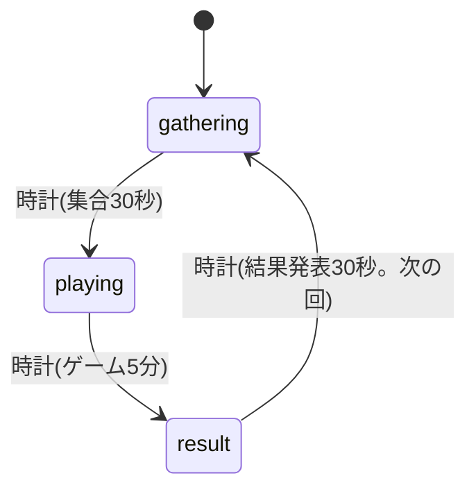

# プロジェクト用語集 (Glossary)

## 概要

このドキュメントは、Number Together のドキュメントとコードで使う用語を定義する。ドキュメントでは日本語の用語を、コードでは「英語表記(コード上の名前)」を使い、両者の対応をここで固定する。

**更新日**: 2026-10-09(用語を追加・変更したら、この日付も直す)

技術用語の表には、このプロジェクトで使う道具・サービス・形式を載せる。略語・頭字語の表には、文章の中で、略して書く言葉を載せる。

**使わない用語**:

| 用語 | 理由 | 代わりに使う用語 |
|------|------|-----------------|
| 部屋1・部屋2(部屋の番号の表示) | 部屋は裏側で割り振り、ユーザーには見せない | (なし) |
| 観戦・見ているだけ | 待機中は、ゲームの様子を見せない(どの部屋を見るか決められないため) | 待機 |
| AIの強さ | AIには、強さの段階がなく、性格がある | AIの性格 |
| 許容幅 | 検討の途中で使った言葉 | 範囲 |
| ログイン・アカウント登録 | 匿名認証で、ログインも登録もない | 名前とキャラクターを選ぶ |
| 「+3」の吹き出し | 倍増タイム中も「+1」のまま。「+3」だと、目標の数字が3増えたように見えるため | 「+1」の吹き出し |
| 満員の案内・新しい部屋への案内 | 部屋の移動は、ユーザーに知らせない | 待機(満員) |

## ドメイン用語

ゲームのルールと遊び方に関する用語。ルールの正式な定義は `docs/product-requirements.md` の「ゲームのルール」にある。

### ゲームの流れ

#### 回(ラウンド)

**定義**: 「集合 → ゲーム → 結果発表」の1周。

**説明**: 1周は、集合30秒・ゲーム5分・結果発表30秒(仮置き。設定で変える)。サーバー時刻から、回の番号を計算する。誰かが開始を書き込むのではなく、全員(と、データベースのセキュリティルール)が同じ計算をする。

**関連用語**: 段階、常時開催

**英語表記**: round(番号は `roundIndex`、データベースのキーは `roundId`。`roundId` は、`roundIndex` を10進の文字列にしたもの)

#### 段階

**定義**: 回の中の、集合中・ゲーム中・結果発表のどれか。

| 段階 | 意味 | コード上の名前 |
|------|------|---------------|
| 集合中 | 参加者が集まる。目標と範囲、カウントダウンを表示する | `gathering` |
| ゲーム中 | +1・−1で共有の数字を動かす | `playing` |
| 結果発表 | 成功・失敗と、全員のポイントを見せる | `result` |

**関連用語**: 回、常時開催

**英語表記**: phase(`Phase`)

#### 常時開催

**定義**: ゲームが止まらず、回が時計だけで次々に進むこと。

**説明**: 人間が誰もいない回は、そのまま過ぎる。いつ来ても、いまの段階から参加できる。

**関連用語**: 回、途中参加

**英語表記**: always-on

#### 途中参加

**定義**: ゲーム中に、後から参加すること。

**説明**: 終了の1分前までは、入れる。入った人の分(200)だけ、目標が増える。終了の1分前以降は、次の回の集合まで、待機になる。

**関連用語**: 目標、待機、召喚

**英語表記**: late join(`joinedDuring: 'playing'`)

#### 待機

**定義**: 入れないときに、次の回の集合まで待つ状態。

**説明**: 理由は2つ。「ゲーム中に来て、全部の部屋が満員」(`full`)と「終了の1分前以降、または結果発表中に来た」(`lastMinute`)。待機画面には、理由と、次の回までのカウントダウンだけを出し、ゲームの様子は見せない。

**関連用語**: 途中参加、部屋

**英語表記**: wait(理由は `'full'`・`'lastMinute'`)

### 数字と目標

#### 共有の数字

**定義**: 参加者全員が、+1・−1で動かす、1つの数字。

**説明**: 0から始まる。全員の操作が、同じ数字に足し引きされる。サーバー側で加算するので、同時に押しても取りこぼさない。

**関連用語**: 目標、範囲、ボタン

**英語表記**: number(`number`)

#### 目標

**定義**: 共有の数字を合わせたい値。参加人数(AIを含む)×200。

**説明**: 人が増えると上がり、人が抜けても下がらない。AIも人数に入る。1人あたり200は、仮置きで、設定で変える。例: 5人=1,000、12人=2,400、20人=4,000。

**関連用語**: 範囲、共有の数字、目標UP

**英語表記**: target(`target`、1人あたりは `perPlayerTarget`)

#### 範囲

**定義**: 目標の±10%の間。成功とみなされる幅。

**説明**: 下端は目標×0.9を切り上げた整数、上端は目標×1.1を切り下げた整数。例: 目標1,000なら、900〜1,100。

**関連用語**: 目標、範囲内、成功

**英語表記**: range(下端 `lower`、上端 `upper`)

#### 範囲内

**定義**: 共有の数字が、範囲の中(両端を含む)にあること。

**説明**: 画面では、緑の「範囲内!」の札で示す。範囲の外のときは、色と文言を変える。倍増タイム中のポイントの判定にも使う。

**関連用語**: 範囲、倍増タイム

**英語表記**: in range(`isInRange`、画面の状態は `inRange`)

#### 成功・ぴったり・失敗

**定義**: ゲーム終了の瞬間の共有の数字で決まる、結果の3通り。

| 結果 | 条件 | コード上の名前 |
|------|------|---------------|
| ぴったり | 数字が、目標と同じ | `perfect` |
| 成功 | 数字が、範囲の中(ぴったり以外) | `success` |
| 失敗 | 数字が、範囲の外 | `fail` |

**説明**: 途中で目標に達しても、成功にはならない。終了の瞬間だけで判定する。失敗のときは、あと何足りなかったか(範囲に届かなかった量)を出す。

**関連用語**: 範囲、判定、報酬

**英語表記**: outcome(`Outcome`、足りなかった量は `missBy`)

#### 判定

**定義**: ゲーム終了時の数字と目標から、結果(ぴったり・成功・失敗)を決めること。

**説明**: ドメイン層の `judge` が行う。結果は、終了の3秒後に出す(最後のポイントの書き込みを待つ猶予)。

**関連用語**: 成功・ぴったり・失敗、猶予

**英語表記**: judge(`judge`)

### ポイント

#### ポイント

**定義**: +1を押すたびに貯まる、個人の点数。

**説明**: 普通は1回につき1ポイント。倍増タイム中で、範囲の中なら3ポイント。−1は、ポイントに影響しない。自分のポイントは、ゲーム中も本人にだけ見える。他の人のポイントは、結果発表まで見えない。

**関連用語**: 倍増タイム、報酬、累計ポイント

**英語表記**: points(`points`)

#### 倍増タイム

**定義**: ゲームの最後の1分(仮置き)。範囲の中で押した+1が、3倍のポイントになる。

**説明**: 長さと倍率は、設定で変える。画面では、グラフの未来の部分に、斜線の帯(「×3 ボーナス」)で示す。

**関連用語**: ポイント、範囲内

**英語表記**: bonus(`bonusStartsAt`・`bonusActive`、倍率は `bonusMultiplier`)

#### 報酬

**定義**: 結果に応じて、実際に得られるポイント。

**説明**: 成功のときだけ、貯めたポイントが報酬になる。ぴったりのときは、さらにボーナスの倍率(仮に×2)が掛かる。失敗のときは0で、貯まっていたポイントは、結果発表で公開するだけ。

**関連用語**: ポイント、累計ポイント

**英語表記**: award(`settle` で求める。`awarded`)

#### 累計ポイント

**定義**: 実績として保存される、報酬の合計。

**説明**: 失敗した回のポイントは入らない。AIの分は記録しない。

**関連用語**: 実績、報酬、ランキング

**英語表記**: total points(`totalPoints`)

#### ランキング

**定義**: 累計ポイントや成功回数の多い順に、人間のプレイヤーを並べたもの。P1の機能(PRDの機能15)。

**説明**: AIは入れない。結果発表の一覧(その回のポイントの順位)とは、別のもの。

**関連用語**: 累計ポイント、実績、結果発表の一覧

**英語表記**: ranking(画面は `RankingScreen`。結果発表の一覧の `buildRanking`・`RankingView` とは別)

### 参加者

#### 部屋

**定義**: 最大20人で遊ぶ単位。

**説明**: 20人を超えたら、裏側で次の部屋に割り振る(先着)。新しい部屋を作るのは、集合中のときだけ。ユーザーには、部屋の番号も、部屋の移動も見せない。

**関連用語**: プレイヤー、待機

**英語表記**: room(`roomId`)

#### プレイヤー

**定義**: 回に参加している、人間またはAI。

**説明**: 回の参加者の一覧は、追加するだけで、人が抜けても削除しない。目標は、この数から計算するので、人が抜けても下がらない。

**関連用語**: 人間、AI、目標

**英語表記**: player(`Player`、種類は `kind: 'human' | 'ai'`)

#### 人間

**定義**: 実際に遊んでいる人。匿名認証のIDを持つ。

**英語表記**: human(`kind: 'human'`、IDは `uid`)

#### AI

**定義**: 人間が5人未満のとき、5人にそろえるために加わる、コンピューターの参加者。

**説明**: ClaudeなどのAI(LLM)にはつながない。ブラウザの中の、単純なルールと確率のプログラムで動く。数は、ゲーム開始時点で決め、途中で人間が入ってきても変えない(ゲーム開始の時刻に人間が誰もいなかった回だけは、最初の人間が来た時点で、AIを足す)。回の途中で人間が全員抜けたら、AIも止まる。画面には、「がめついAI」のように、性格の名前に「AI」を付けて出す。AIの成績は、実績やランキングに記録しない。

**関連用語**: AIの性格、AI担当、プレイヤー

**英語表記**: AI(`kind: 'ai'`)

#### AIの性格

**定義**: AIの手の選び方の違い。5種類。

| 性格 | 日本語の表示 | 英語の表示 | コード上の名前 |
|------|-------------|-----------|---------------|
| がめつい | がめついAI | Grabby AI | `greedy` |
| 調整役 | 調整役AI | Balancer AI | `balancer` |
| ぴったり主義 | ぴったり主義AI | Perfectionist AI | `perfectionist` |
| 気まぐれ | 気まぐれAI | Moody AI | `moody` |
| ラストスパート | ラストスパートAI | Last-Spurt AI | `lastSpurt` |

注意: AIの性格「がめつい」(`AiPersonality` の `'greedy'`)と、称号「欲張り」(`TitleId` の `'hoarder'`)は、似た意味だが、別のもの。英語の表示は、どちらも「Greedy」を含むので、文章では、「性格のがめつい」「称号の欲張り」のように区別する。

**関連用語**: AI、称号

**英語表記**: AI personality(`AiPersonality`)

#### AIの勢い

**定義**: AIごとの、押す頻度の倍率。AIが加わったときに、1 ± `tempoSpread`(0.8)の間で乱数で決め、そのAIの性格の頻度すべてに掛ける。同じ性格でも、押す速さに個体差を出すため。画面には出さない。

**関連用語**: AIの性格

**英語表記**: AI tempo(`tempoFor`・`withTempo`)

#### AI担当

**定義**: 部屋の中で、AIの操作を、代わりにデータベースに送る人間のブラウザ。

**説明**: 入った順が最も古い人間が担当になる。担当が抜けたら、次に古い参加者が引き継ぐ。AIの追加と、古い回のデータの削除(2回分だけ残す)も、担当が行う。ゲーム開始の時刻に人間が誰もいなかった回は、途中から来た最初の人が担当になり、その時点でAIを足す。

**関連用語**: AI、部屋

**英語表記**: AI host(`aiHost`)

#### 名前

**定義**: 本人が付ける、ニックネーム。ほかの人にも見える。

**説明**: 画面に表示したときの幅が同じくらいになるよう、全角6文字・半角12文字まで。混ざっているときは、全角を2、半角を1と数えて、合計12まで。翻訳しない。

**関連用語**: キャラクター、名前の長さ

**英語表記**: name(`Profile.name`)

#### キャラクター

**定義**: 髪型・服の色・小物を組み合わせた、人間の小人の見た目。

**関連用語**: 小人、名前

**英語表記**: character(`CharacterSpec`)

#### 称号

**定義**: 実績から決まる、通り名。新人・常連・欲張り・ぴったり王。

**説明**: 条件は、設定で変える(仮。最初の実装の条件は、機能設計書の「Titles(称号)」)。集合中の画面で、名前の下に表示する。

| 称号 | 英語の表示 | コード上の名前 |
|------|-----------|---------------|
| 新人 | Rookie | `rookie` |
| 常連 | Regular | `regular` |
| 欲張り | Greedy | `hoarder` |
| ぴったり王 | Perfect King | `perfectKing` |

**関連用語**: 実績、称号の帯

**英語表記**: title(`TitleId`: `rookie`・`regular`・`hoarder`・`perfectKing`)

#### 実績

**定義**: 参加回数・成功回数・ぴったり成功の回数・累計ポイントの記録。

**説明**: 人間だけに記録され、他のプレイヤーにも見える。同じ回を二重に数えない。ブラウザのデータを消したり、ほかの端末で開いたりすると、別の人として扱われ、引き継がれない。

**関連用語**: 称号、実績カード、累計ポイント

**英語表記**: stats(`Stats`)

### 画面と演出

#### 小人

**定義**: 参加者を表す、小さなキャラクター。いま押している人が跳ねる。

**説明**: 人間は、選んだキャラクターの姿で、AIは、ロボットの姿(胸のランプの色で性格が分かる)。+1か−1かは、分からない。

**関連用語**: 小人の舞台、押した合図

**英語表記**: avatar(人間は `characterSvg`、AIは `robotSvg`)

#### 小人の舞台

**定義**: 画面の上にある、小人が並ぶ領域。

**説明**: 20人が1列に並び、隣どうしが体の約1/3ずつ重なる。自分の小人は、いちばん手前に出し、頭の上に「あなた」の吹き出しを出す。

**英語表記**: stage(`StageView`)

#### 「あなた」の吹き出し

**定義**: 自分の小人の頭の上に、いつも出る、ピンクの小さな吹き出し。

**関連用語**: 小人、「+1」の吹き出し

**英語表記**: you bubble

#### 「+1」の吹き出し

**定義**: 自分が押した瞬間に、自分の小人の頭の横に浮かんで消える、小さな吹き出し。

**説明**: 倍増タイム中も「+1」のまま。−1のときは「−1」。自分にだけ出る。

**関連用語**: 倍増タイム、ポイント

**英語表記**: plus-one bubble

#### 押した合図

**定義**: 「いま押した」ことを、他の人の画面に伝える信号。小人を跳ねさせるのに使う。

**説明**: +1か−1かは含まない。1人につき、1秒に1回までにまとめる。直近の押し方の強さ(`power`。0〜3。直近1秒に押した回数から、`pulsePowerFor` で決める)を含む。

**注意**: 「合図」という言葉は、「ゲーム中の演出」(3・2・1・スタートなど)にも使う。区別するため、文章では「押した合図」と「演出」を使い分ける。

**関連用語**: 小人、演出

**英語表記**: pulse(`Pulse`)

#### 演出

**定義**: ゲームの節目に出す、画面全体の合図。

| 演出 | 出す時刻 | コード上の名前 |
|------|---------|---------------|
| 3・2・1・スタート! | 集合からゲームに変わる瞬間 | `start` |
| ×3 タイム スタート! | 倍増タイムに入る瞬間 | `x3` |
| 終了10秒前 | 残り10秒 | `tenSeconds` |
| 終了! | 時間切れの瞬間 | `end` |

**関連用語**: 押した合図、倍増タイム

**英語表記**: cue(`cue`)

#### グラフ

**定義**: 共有の数字の変化を、線で示すもの。

**説明**: 縦軸は、値0(下端)から目標×1.3(上端)。範囲を緑の帯で、目標を点線で示す。横軸は時間で、右から1/3あたりが「いま」。「いま」までを線で描き、右側(未来)は線を引かない。

**関連用語**: いま、未来、×3ゾーン、終了の線

**英語表記**: graph(`GraphView`)

#### いま・未来

**定義**: グラフの横軸で、現在の時刻を「いま」(点線と丸印)、それより右を「未来」とする。

**説明**: 「いま」は、グラフの幅の約2/3(66.7%)の位置。未来の長さは、約60秒分(仮置き)。

**関連用語**: グラフ、×3ゾーン

**英語表記**: now / future(`pastWindowMs`・`futureWindowMs`)

#### ×3ゾーン

**定義**: グラフの未来の部分に出す、倍増タイムの時間帯を示す斜線の帯。「×3 ボーナス」の札が付く。

**関連用語**: 倍増タイム、グラフ

**英語表記**: bonus zone

#### 終了の線

**定義**: グラフの未来の部分に出す、ゲームが終わる時刻を示す縦線。「終」と「了」(英語では「OV」「ER」)の札の間を、線が通る。

**説明**: 残り時間が減ると、「いま」に近づく。

**関連用語**: グラフ、残り時間

**英語表記**: end line

#### 残り時間

**定義**: ゲーム終了までの時間。グラフの左上に、「残り 0:48」の形で出す。

**説明**: 残りが10秒を切ったら、赤い背景で強調して脈動させる。

**英語表記**: time left

#### 目標UP

**定義**: 途中参加で、目標が増えたときに出す演出。「目標UP! 3800 → 4000」の吹き出しを出し、グラフの帯と点線が動く。

**関連用語**: 途中参加、召喚、目標

**英語表記**: target up

#### 召喚

**定義**: ゲーム中の途中参加で、新しい人の小人が、画面の上から、光の柱の中を、ゆっくり降りてくる演出。

**説明**: 上から降りてくるのは、ゲーム中だけ。集合中に入る人は、そのまま席に現れ、AIは、席にフェードインする。

**関連用語**: 目標UP、フェードイン

**英語表記**: summon

#### 称号の帯

**定義**: 称号のある人が、ゲーム中に途中参加したときに出る、「ぴったり王 ○○さん参戦!」のような帯。

**説明**: 召喚と同時に出す。プレイ中は実績を見せない、という考えとは合わないが、途中参加の人だけに出してみる。あとから消すかもしれない(PRDの「このゲームで決めたこと」)。

**関連用語**: 称号、召喚、途中参加

**英語表記**: title banner

#### フェードイン

**定義**: 集合中に、AIが、参加者の席に、ふわっと現れる動き。

**関連用語**: 召喚、AI

**英語表記**: fade in

#### 実績カード

**定義**: 小人をタップしたときに出る、名前・称号・実績のカード。

**説明**: 人間の小人だけ。AIの小人は、名前の吹き出しだけを出す。ほかをタップすると閉じる。

**関連用語**: 実績、称号

**英語表記**: achievement card(`AchievementCard`)

#### 自分の画面

**定義**: 自分の小人・名前・称号・実績と、「名前・キャラをかえる」ボタン、「動きをへらす」のスイッチを出す画面。

**英語表記**: my page(`MyPageScreen`)

#### 言語切り替えボタン

**定義**: どの画面でも右上にある、日本語と英語を切り替えるボタン。切り替えた先の言語名を表示する(今が日本語なら「English」)。

**説明**: 自分の画面だけに効く。進行中の状態は、そのままで、文言だけが変わる。選んだ言語は、ブラウザに覚える。

**英語表記**: language switch(`LanguageSwitch`、言語は `Lang`: `'ja'`・`'en'`)

#### 動きを減らす

**定義**: 端末の `prefers-reduced-motion` の設定、または自分の画面のスイッチ。有効なときは、動きをやめて、静止した表示にする。

**英語表記**: reduce motion

### 接続

#### 再接続

**定義**: 通信が切れたとき、自動でつなぎ直すこと。

**説明**: 切れてから60秒以内にもどり、終了の1分前までなら、続きから参加できる。60秒以上つながらなければ、次の回の集合から参加する。

**英語表記**: reconnect(猶予は `reconnectGraceMs`)

#### 混雑中

**定義**: 同時接続の上限(無料プランは100)に近づいて、つながらない状態。

**説明**: 10秒ごとに自動で試す。画面では、「いま混み合ってるよ」と出す。

**英語表記**: busy

#### 猶予

**定義**: 遅れて届く操作を待つための、決まった時間。

**説明**: 2種類ある。「ポイントの猶予」は、終了の3秒後まで、ポイントを書き込める時間(結果は、その後に出す)。「再接続の猶予」は、切れてから60秒(上の「再接続」)。

**英語表記**: grace period(ポイントの猶予は `pointsGraceMs`、再接続の猶予は `reconnectGraceMs`)

## 技術用語

| 技術 | 定義 | 本プロジェクトでの用途 | バージョン |
|------|------|-----------------------|-----------|
| Firebase | Googleのアプリ開発用のサービス群 | 全員で共有するデータの置き場所 | — |
| Realtime Database | Firebaseの、変化がすぐ全員に届くデータベース | 共有の数字、参加者、押した合図、ポイント、名前・実績 | — |
| 匿名認証 | メールやパスワードなしで、ブラウザごとにIDを割り当てる方式 | ログイン不要の参加 | — |
| Emulator Suite | Firebaseを、自分のパソコンで動かして試す仕組み(データベースのエミュレータには Java が必要) | 開発とテスト | firebase-tools 8.14.0 以上 |
| セキュリティルール | データベースの読み書きの権限を決める設定(`database.rules.json`) | 他人のポイントを隠す、終了後の書き込みを断る | — |
| increment | データベース側で、数字を足し引きする命令 | 共有の数字の加算(同時に押しても取りこぼさない) | — |
| トランザクション(条件付きの書き込み) | 条件を満たすときだけ書く仕組み | 部屋への入室(20人を超えない) | — |
| onDisconnect | 接続が切れたときに、自動で実行される処理 | 参加中の印(presence)の削除 | — |
| presence | 部屋に参加している印 | AI担当の決定、部屋の人数 | — |
| serverTimeOffset | 端末の時計と、サーバーの時計の差 | 全員で同じ時刻をもとに、進行を計算する | — |
| Node.js | JavaScript の実行環境 | 開発時のビルド・テスト・スクリプト | v24 LTS |
| npm | Node.js に同梱のパッケージ管理ツール | 依存の管理とスクリプトの実行 | 11.x |
| TypeScript | 型のある JavaScript | すべてのソースコード | 5.9.x |
| SVG | 図形を記述するXMLベースの画像形式 | 小人・グラフの描画 | — |
| Vite | 開発サーバーとビルドツール | 開発サーバー、`dist/` の出力 | 8.x |
| tsx | TypeScript をそのまま Node.js で実行するツール | 配信サイズの確認とzip作りのスクリプト | 最新安定版 |
| Vitest | テストフレームワーク | ユニットテスト、ルールのテスト、結合テスト、シミュレーション | 5.x |
| Playwright | ブラウザ自動操作によるテストツール | E2Eテスト(Chromium・Firefox・WebKit) | 1.63.x |
| ESLint / Prettier | 静的解析 / 整形ツール | コードの品質と層の依存ルールの強制 / 整形 | 9.x / 3.x |
| husky / lint-staged | Git フックの管理 / 変更ファイルへのコマンド実行 | コミット前のチェック | 9.x / 15.x |
| itch.io | インディーゲームの公開サイト | ゲームの公開先(HTML5ゲームとしてzipをアップロード) | — |
| iframe | ページの中に、別のページを埋め込む仕組み | itch.io は、ゲームを iframe の中で動かす(保存領域の制限に注意) | — |
| Spark / Blaze | Firebaseの、無料プラン / 従量課金プラン | 無料プランは、同時接続100・ダウンロード月10GBまで | — |
| butler | itch.io 公式のアップロードツール | 将来のアップロードの自動化(検討中) | — |
| GitHub Actions | GitHub のCIサービス | lint・型チェック・テスト・ビルドの自動実行 | — |

詳細は `docs/architecture.md` の「テクノロジースタック」を参照。

## 略語・頭字語

| 略語 | 正式名称 | 意味・本プロジェクトでの使用 |
|------|----------|------------------------------|
| PRD | Product Requirements Document | プロダクト要求定義書(`docs/product-requirements.md`) |
| MVP | Minimum Viable Product | 最初の版。優先度P0の機能 |
| P0・P1・P2 | Priority 0・1・2 | 機能の優先度。P0は最初の版、P1は初期リリース後すぐ、P2は将来 |
| KPI | Key Performance Indicator | 成功指標。自動テストとプレイテストで測る |
| AI | Artificial Intelligence | このプロジェクトでは、ゲームの中の、コンピューターの参加者。ClaudeなどのLLMにはつながない |
| E2E | End to End | 画面を実際に操作して一連の流れを確かめるテスト |
| CI | Continuous Integration | push ごとの自動チェック(GitHub Actions) |
| DOM | Document Object Model | ブラウザの画面の要素を扱う仕組み |
| fps | frames per second | アニメーションの1秒あたりのコマ数(目標60) |
| UID | User ID | 匿名認証が割り当てる、ブラウザごとのID。人間のプレイヤーのIDになる |
| i18n | internationalization | 多言語対応。このプロジェクトでは、日本語と英語(`src/app/i18n/`) |

## アーキテクチャ用語

### 層(UI層・アプリケーション層・ドメイン層・インフラ層)

**定義**: ソースコードを責務で分けた4つの層。UI層(画面と入力)、アプリケーション層(参加・進行・連打のまとめ送り・AI担当)、ドメイン層(ルール・判定・AIの手)、インフラ層(Firebase・時計・設定の保存)。

**本プロジェクトでの適用**: 依存の向きは、UI → アプリケーション → ドメインと、アプリケーション → インフラの「インターフェース」。ドメイン層は、どこにも依存しない。各層の責務、ディレクトリ、依存のルールは `docs/architecture.md` の「アーキテクチャパターン」と `docs/repository-structure.md` を正とする。

### GameStore

**定義**: Firebase とのやりとりを、インターフェースにしたもの。

**本プロジェクトでの適用**: Firebase用の実装(`FirebaseGameStore`)と、メモリ上の実装(`InMemoryGameStore`)の2つがある。後者で、ルールやAIの動きを、ネットワークなしで試せる。

**英語表記**: `GameStore`(`src/infra/store/GameStore.ts`)

### 主なコンポーネント

| 名前 | 層 | 責務(1行) |
|------|----|-----------|
| `SessionController` | アプリケーション | 登録・サインイン・部屋への入室と退出・接続の状態・AI担当の引き継ぎ |
| `RoundController` | アプリケーション | 時計を見た画面の切り替え、`RoundView` の組み立て、押した操作の処理、結果の計算 |
| `PressBatcher` | アプリケーション | 連打を0.2秒ごとにまとめて送る(1回±50まで)。合図を1秒に1回にまとめる |
| `AiHost` | アプリケーション | AI担当のブラウザで、AIの追加と、AIの操作の送信、古い回の削除を行う |
| `DomGameView` | UI | セッションの状態と回の view を購読して、画面を切り替えて描く |
| `AiBrain` | ドメイン | AIの性格ごとの手の選択(`decide`。`src/domain/ai/`) |
| `TrafficMeter` | インフラ | 通信量の計測(テスト用。`VITE_TRAFFIC_METER=1` のときだけ) |

詳しい責務は `docs/functional-design.md` の「コンポーネント設計」を正とする。

### 画面の状態

**定義**: 画面の部品が見る、まとめた状態。データベースの値と時計から、毎回組み立てる。

**英語表記**: round view(`RoundView`)

### 純粋関数

**定義**: 同じ引数には必ず同じ結果を返し、引数や外の状態を書き換えない関数。

**本プロジェクトでの適用**: ドメイン層の関数はすべて純粋関数にする。時刻と乱数は、引数で受け取る(`Random` インターフェース、`ServerClock.now()`)。

### イミュータブル

**定義**: 一度作った値を書き換えないこと。

**本プロジェクトでの適用**: 状態は書き換えず、新しい値を作る。

### 設定ファイル

**定義**: 遊びながら調整する値(1人あたりの目標、範囲の割合、倍率、時間、人数、通信の間隔など)を、1か所にまとめたもの。

**本プロジェクトでの適用**: `src/domain/config/defaultConfig.ts` の `DEFAULT_CONFIG`。データベースのセキュリティルール(`database.rules.json`)にも、同じ値(1周の長さ、ゲームの開始と終了、ポイントの猶予の3秒、20人、±50など)があるので、変えるときは、両方をそろえる(対応は `docs/architecture.md` の「データベースの配置とセキュリティルール」)。

**英語表記**: game config(`GameConfig`)

### ステアリング

**定義**: 作業ごとに「今回何をするか」を書く文書のまとまり。

**本プロジェクトでの適用**: `.steering/[YYYYMMDD]-[作業名]/` に `requirements.md`・`design.md`・`tasklist.md` を置く。1つのステアリングに1つの作業ブランチを対応させる。

## ステータス・状態

### 段階

| 段階 | 意味 | 遷移条件 | 次の段階 |
|------|------|---------|---------|
| `gathering` | 集合中 | 集合の時間(30秒)が終わる | `playing` |
| `playing` | ゲーム中 | ゲームの時間(5分)が終わる | `result` |
| `result` | 結果発表 | 結果発表の時間(30秒)が終わる | 次の回の `gathering` |

**状態遷移図**:

遷移は、すべて時計だけで決まる。ゲームの途中で、早く終わることも、早く始まることもない。

**英語表記**: phase(`Phase`)

### 画面

| 画面 | 見本のファイル | 意味 |
|------|---------------|------|
| 名前とキャラクター選び | `01-setup.html` | 初回だけ |
| 集合中 | `02-lobby.html`・`03-lobby-ai.html` | 参加者・目標・カウントダウン。人が少ないときは、AIが加わる |
| 3・2・1・スタート! | `04-start.html` | 演出 |
| プレイ中 | `05-play.html`・`06-play-late-join.html` | 小人・数字・グラフ・ボタン。途中参加の称号の帯 |
| ×3 タイム スタート! | `07-x3-start.html` | 演出 |
| 終了10秒前 | `08-ten-seconds.html` | 演出 |
| 終了! | `09-end.html` | 演出 |
| 結果発表 | `10-result-perfect.html`・`11-result-clear.html`・`12-result-fail.html` | ぴったり・成功・失敗 |
| 実績カード | `13-achievement-card.html` | 小人をタップしたとき |
| 待機 | `14-wait-full.html`・`15-wait-last-minute.html` | 満員・終了間際・結果発表中(結果発表中は15を使う) |
| 通信が切れたとき | `16-offline.html` | 再接続 |
| 混雑中 | `17-busy.html` | つながらない |
| 自分の画面 | `18-me.html` | 名前・実績・設定 |

画面の遷移は `docs/functional-design.md` の「画面遷移図」を参照。

## データモデル用語

| 型 | 定義 | 主なフィールド | 定義場所 |
|----|------|---------------|---------|
| `GameConfig` | 設定値(仮の値をまとめたもの) | `gatherMs`・`playMs`・`resultMs`・`perPlayerTarget`・`rangeRatio`・`bonusMultiplier` など | `src/domain/config/types.ts` |
| `RoundClock` | サーバー時刻から計算した、いまの回と段階 | `roundIndex`・`phase`・`playStartsAt`・`playEndsAt`・`bonusStartsAt` | `src/domain/schedule/types.ts` |
| `Profile` | 名前とキャラクター | `name`・`character` | `src/domain/types.ts` |
| `CharacterSpec` | キャラクターの見た目 | `hair`・`shirtColor`・`accessory` | `src/domain/types.ts` |
| `Stats` | 実績 | `plays`・`successes`・`perfects`・`totalPoints`・`lastCountedRound` | `src/domain/types.ts` |
| `Player` | 回の参加者(人間・AI) | `id`・`kind`・`uid`・`name`・`character`・`personality`・`joinedAt`・`joinedDuring` | `src/domain/types.ts` |
| `RoundData` | データベースに置く、回のデータ | `number`・`players`・`pulses`・`points` | `src/domain/types.ts` |
| `Pulse` | 押した合図 | `t`・`power` | `src/domain/types.ts` |
| `RoundView` | 画面に出す、まとめた状態 | `clock`・`number`・`players`・`playerCount`・`target`・`lower`・`upper`・`inRange`・`myPoints`・`bonusActive` | `src/domain/types.ts` |
| `Outcome` | 結果 | `'perfect'`・`'success'`・`'fail'` | `src/domain/types.ts` |
| `AiPersonality` | AIの性格 | `'greedy'`・`'balancer'`・`'perfectionist'`・`'moody'`・`'lastSpurt'` | `src/domain/types.ts` |
| `TitleId` | 称号 | `'rookie'`・`'regular'`・`'hoarder'`・`'perfectKing'` | `src/domain/types.ts` |

`GameStore` は、上の「アーキテクチャ用語」を参照。

各フィールドの意味は `docs/functional-design.md` の「データモデル定義」を参照。

## エラー・例外

### 通信・データベースのエラー

**クラス名**: `StoreError`

**発生条件**: データベースへの書き込みや読み込みに失敗したとき(`firebase/*` のエラーを、インフラ層で変換したもの)。

**対処方法**: アプリケーション層が、機能設計書の「エラーハンドリング」の表に従って、利用者に表示する。書き込みがルールに拒否された場合(終了後の加算など)は、エラーにせず、画面をデータベースの値に合わせる。

### 名前の検証

**発生条件**: 名前が、空、長すぎる(全角を2、半角を1と数えて12を超える)、使えない文字を含む。

**対処方法**: `validateName` が、結果の値(`{ ok: false, reason: 'empty' | 'tooLong' | 'invalidChar' }`)を返す。登録ボタンを押せなくする。入力欄には、数えた量(「6 / 12」)だけを出し、理由の説明は出さない(PRDのスコープ外)。

### 想定外のエラー

**発生条件**: 上記以外のエラー。

**対処方法**: 画面全体を止め、「エラーが起きました。ページを再読み込みしてください」と、再読み込みボタンを出す。

## 計算・アルゴリズム

計算式と例は、`docs/functional-design.md` の「アルゴリズム設計」を正とする。ここでは、計算の名前と、実装する場所だけを示す。

| 計算 | 意味 | 機能設計書の節 | 実装箇所 |
|------|------|---------------|---------|
| 時計から段階を計算する | サーバー時刻から、回の番号・段階・各時刻を求める | 1. 時計から段階を計算する | `src/domain/schedule/roundClockAt.ts` |
| 目標と範囲 | 人数から、目標と範囲の下端・上端を求める | 2. 目標と範囲 | `src/domain/targets/targetFor.ts`・`rangeFor.ts` |
| ポイント | +1を押した瞬間のポイントと、結果による報酬 | 3. ポイントの計算、4. 結果の判定と報酬 | `src/domain/points/pointsForPress.ts`・`settle.ts` |
| 合図の強さ | 直近1秒に押した回数から、`power`(0〜3)を求める | データモデル定義の「エンティティ: Round」(`Pulse`) | `src/domain/pulses/pulsePowerFor.ts` |
| 部屋の割り振り | 入る部屋・新しい部屋・待機を決める | 6. 部屋の割り振り | `src/domain/rooms/planRoom.ts` |
| グラフの位置 | 値と時刻を、グラフの縦横の位置(%)に変える | 9. グラフの描画 | `src/domain/layout/graphGeometry.ts` |
| 名前の長さ | 全角を2、半角を1と数えた合計(12以下なら良い) | コンポーネント設計の「Names」 | `src/domain/names/nameUnits.ts` |
